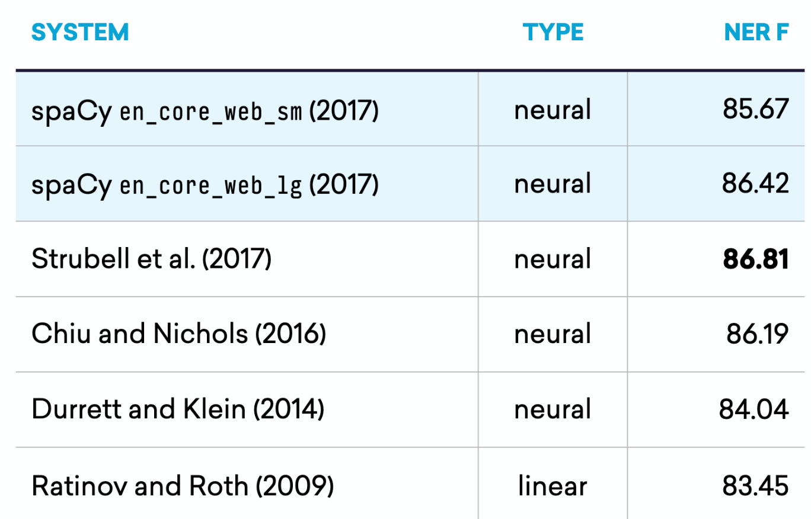

\newpage
# Definición del problema {#problem-definition}

## Conceptos básicos

### Entidad nombrada

En el contexto de _extracción de información_, una _entidad nombrada_ es un objeto del mundo real como lo son personas, ubicaciones, organizaciones, productos, etc; que pueden denotarse con un nombre propio. La entidad puede ser abstracto o tener existencia física. Ejemplos de entidades nombradas son "Mauricio Macri", "Ciudad Autónoma de Buenos Aires", "Apple Macbook".
También se suele definir sencillamente como aquellas entidades que se pueden ver como instancias de entidad (por ejemplo, la Ciudad Autónoma de Buenos Aires es una instancia de una ciudad).


#### Definición formal {#ner-formal}

Formalmente el concepto de "entidad nombrada" se deriva de la definición del filósofo estadounidense **Saul Kripke** de **designador rígido** [@kripke1980naming] que forma parte de la lógica modal y filosofía del lenguaje.

> Un designador rígido designa a una misma entidad en todos los mundos posibles en los que esa entidad existe, y no designa nada en aquellos mundos en los que no existe.

Algunos ejemplos de designadores rígidos son:

* Nombres propios como "Saul Kripke", "Júpiter", "Londres", "4" y "Hércules".
* Descripciones definidas matemáticas como "la raíz cuadrada de 4" y "8 - 2".
* Nombres de clases naturales como "agua" y "bronce".
* Nombres de sensaciones como "dolor" y "alegría".

Por el contrario, los **designadores flácidos** pueden designar diferentes cosas en diferentes mundos posibles y **no** son _entidades nombradas_.

Por ejemplo en la oración: "Mauricio Macri es el presidente de Argentina":

* "Mauricio Macri" y "Argentina" son _entidades nombradas_, ya que se refieren a objetos específicos.
* "presidente" y "presidente de Argentina" no son _entidades nombradas_, ya que pueden usarse para referirse a muchos objetos diferentes en mundos diferentes:
  * "presidente" puede ser de diferentes países u organizaciones que se refieren a diferentes personas.
  * "presidente de Argentina", si bien hace referencia a un mismo pais, puede ser de diferentes períodos presidenciales que se refieren a diferentes personas.

#### Definición no estricta

Existe un acuerdo general en la comunidad _NER_ para considerar como entidades nombradas a otro tipos de entidades que violan el principio de designador rígido. Ejemplos de esto son:

* expresiones temporales como '3 de febrero', '2019'.
* expresiones numéricas, como cantidades de dinero y otros tipos de unidades
* expresiones que según contexto denotan una entidad rígida pero no en sí mismas. Por ejemplo "Alfredo Fortabat, empresario argentino, fundador de la compañía cementera Loma Negra." puede ser considerada una entidad nombrada, sin embargo, el término "Fortabat" por si sólo podría referirse a su viuda "María Amalia Lacroze de Fortabat", al museo de arte "Museo Fortabat" o a la localidad Argentina "Villa Alfredo Fortabat".

En este trabajo hemos priorizado esta definición laxa para tener una mayor expresividad en los tipos de entidades que vamos a detectar. Por lo tanto, en adelante, la definición del término "entidad nombrada" será utilizada bajo una definición no estricta.

### Reconocimiento de entidades

El Reconocimiento de entidades nombradas a menudo se divide en dos problemas distintos:

1. Detección de nombres
2. Clasificación de los nombres según el tipo de entidad al que hacen referencia a (persona, organización, ubicación y otro)

En la primera fase los nombres se definen como tramos contiguos de tokens, sin anidamiento, de modo que "Instituto Tecnológico de Buenos Aires" es una entidad única, sin tener en cuenta el hecho de que dentro de esta, la subcadena "Buenos Aires" es en sí otra entidad.

Esta forma de definir el problema, lo reduce a un problema de segmentación.

La segunda fase requiere elegir una ontología para organizar categorías de cosas.

#### Dificultades para encontrar mejores algoritmos

El estado del arte de _NER_ desde 2014 con la introducción de Redes Neuronales ha llegado a una meseta [@honnibal_NER]. En los últimos años el diferencial capitalizado por los diferentes grupos de investigación especializados fue muy reducido. Como puede verse en la figura \@ref(fig:spacy-algos).

```{r spacy-algos, echo = FALSE, fig.pos="H", fig.align = 'center', fig.cap='Principales avances del estado del arte para NER en los últimos años.'}

```

Las razones por las cuales esto ocurre escapa el alcance de este trabajo pero se pueden resumir bajo la ley de los rendimientos decrecientes [@lawOfDiminishingReturns]. Se necesita mucho esfuerzo académico para obtener una mejora marginal en el estado del arte actual.

Es por esto que resulta interesante analizar que otro tipo de problemas podemos abordar en este trabajo.

#### Dominios del problema
Existe un hilo conductor en el que todas las investigaciones mencionadas en la figura \@ref(fig:spacy-algos) coinciden; incluso los sistemas _NER_ más avanzadas son frágiles, dado que los sistemas NER desarrollados para un dominio no suelen comportarse bien en otros dominios [@Poibeau2000ProperNE]. La puesta a punto de un sistema _NER_ para un nuevo dominio conlleva un esfuerzo considerable. Esto es cierto para modelos basados en reglas y para sistemas estadísticos.

Se entiende por dominio a todos los textos que en su conjunto forman un _corpus_ común. Ejemplos de estos son "Noticias periodísticas", "Textos jurídicos", "Reportes militares", "Papers académicos", etc.

## Los datos son el problema

Por todo lo mencionado, es evidente que el cuello de botella para el avance de esta y muchas areas de la "Inteligencia Artificial" es el la captura de datos, no los algoritmos [@montani_AI].

La **anotación** en el aprendizaje automático es el proceso de etiquetar datos. Con esto, las algoritmos pueden usar los datos anotados para aprender a reconocer patrones similares cuando se presentan datos nuevos. En particular para el estado actual del arte de _NER_ es necesario tener un subconjunto del cuerpo de textos a analizar (_corpus_) anotado de tal manera que se conozcan previamente la ubicación de entidades, sus nombres y tipo.

Este aprendizaje se carga en lo que se reconoce como un **modelo estadístico** y es a ese modelo al que se le pide inferir nuevos resultados. En nuestra experiencia los modelos pre-entrenados de las diferentes plataformas, librerias, frameworks y trabajos académicos resultan siempre insuficientes para el uso en producción de los mismos.

De esta manera queda bien definido el problema que queremos atacar (y el título de este trabajo).

> NERd: anotador eficiente de modelos estadísticos para el reconocimiento de entidades nombradas.

Para este fin se creó un sistema informático que permitirá obtener resultados a la altura de de las soluciones del estado del arte para cualquier _corpus_ de documentos que posea una cantidad suficiente de datos.

El nombre de esta herramienta es **NERd**, sigla cuyo significado en inglés es _**N**amed **E**ntity **R**ecognition **D**uh_^[Expresión de obviedad. _Used to express your belief that what was said was extremely obvious_ [@cambridge_duh]]!
