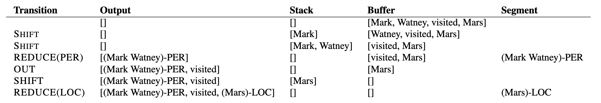
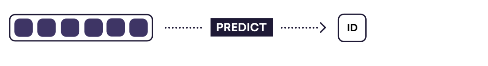

\newpage
# Estado del arte {#state-of-art}

El análisis del estado del arte fue basado en la definición del problema.

## Stack de software

Python es el lenguaje más utilizado para resolver problemas de Machine Learning, en especial NLP [@github_machine_learning]

Spacy es el framework mejor ranqueado para la tarea de NLP [@github_machine_learning] y sabemos por la Figura \@ref(fig:spacy-algos) que obtiene resultados a-la-par del estado del arte actual.

Además la implementación de spacy es robusta y orientada a la creación de apliciones para producción, a diferencia de muchas otras librerías de NLP que sólo se utilizan con fines académicos.

## El pipeline

Todas las operaciones de analisis de lenguaje natural sobre textos no estructurados, tienen como primer paso el de separar el los mismos en tokens. Luego, el documento se procesa en varios pasos diferentes que consisten en el "pipeline de procesamiento". Usualmente los pasos consisten en un etiquetador, un analizador sintáctico y un reconocedor de entidades en el caso de NER.

Cada componente del pipeline devuelve el Doc procesado, que luego se pasa al siguiente componente.

```{r spacy-pipeline, echo = FALSE, fig.pos="H", fig.align = 'center', fig.cap='Pipeline standard para los algoritmos de NER'}
knitr::include_graphics('assets/spacy_pipeline.png')
```

En este capítulo esturiaremos la morfología de dicho pipeline.

## Algoritmo de tokenización

Para tokenizar un texto de manera correcta no basta con separar el mismo en espacios. Dependiendo el lenguaje que se esté estudiando, existen "excepciones" a esta regla y otros caracteres que representan separaciones entre tokens segun el contexto de los mismos.

En particular, spaCy posee algoritmo de tokenización inteligente que puede ser resumido de la siguiente manera:

1. Iterar sobre subcadenas separadas por espacios en blanco.
2. Compruebar si existe una regla definida explícitamente para esta subcadena. Si existe, usarla.
3. De lo contrario, intentar consumir un prefijo. Si consumimos un prefijo, regrese al punto#2, para que los casos especiales siempre tengan prioridad.
4. Si no se puede consumir un prefijo, intente consumir un sufijo y luego regrese al punto #2.
5. Si no se puede consumir un prefijo ni un sufijo, buscar un caso especial.
6. Buscar una coincidencia de token
7. Buscar "infijos" - cosas como guiones, etc. y dividir la subcadena en tokens en todos los infijos.
8. Una vez que no se pueda consumir más de la cadena, tratarla como un token único.

Ejemplo:

```{r spacy-tokenization, echo = FALSE, fig.pos="H", fig.align = 'center', fig.cap='Transiciones del modelo Stack-LSTM indicando la acción aplicada y el estado resultante.'}
knitr::include_graphics('assets/spacy_tokenization.png')
```

## Reconocimiento de entidades

### Modelos basados en reglas

Antes de entrar en detalles de cómo trabaja el modelo estadístico de spacy y entender sus fortalezas es importante esbozar brevemente el grupo de algorítmos más "naive" posible. El de los modelos basados en reglas fijas.

En estos modelos se implementan reglas finitas o expresiones regulares para la detección de las entidades. Las principales limitaciones de este enfoque son:

* **Mucho trabajo manua**l: el sistema RB exige un profundo conocimiento del dominio, así como mucho trabajo manual.
* **Consumo de tiempo**: la generación de reglas para un sistema complejo es bastante difícil y requiere mucho tiempo.
* **Menor capacidad de aprendizaje**: el sistema generará el resultado según las reglas, por lo que la capacidad de aprendizaje del sistema por sí mismo es baja.
* **Dominios complejos**: si el corpus demasiado complejo, la creación del sistema RB puede llevar mucho tiempo y análisis. La identificación de patrones complejos es una tarea desafiante en el enfoque RB.

### El enfoque de spaCy

<!-- TODO
2014 neural network CCN ~85%
-->

Cuando se busca mejorar el aprendizaje automático, generalmente se piensa en la eficiencia y la precisión, pero la dimensión más importante es la generalidad.

La mayoría de los problemas de `NLP` pueden reducirse a problemas de aprendizaje automático que toman uno o más textos como entrada. Si podemos transformar estos textos en vectores, podemos reutilizar soluciones de aprendizaje profundo (_deep-learning_) de propósito general.

#### Máquina de estados

Experimentos en inglés, holandés, alemán y español muestran que se pueden obtener resultados a-la-par del estado del arte utilizando un autómata finito determinístico de pila en conjunción con una red neuronal [@DBLP:journals/corr/LampleBSKD16]

Este autómata de pila es el nexo entre la Red Neuronal Convolucional (CNN) que contiene el modelo estadístico para predecir entidades y el texto completo. No se envía el texto entero como input a dicha red, sino que se van enviando cada uno de los estados en los que el autómata de pila se mueve para ir generando entidades con una herística del tipo _greedy_.

Las posibles acciones de transición de este autómata son las siguientes:

```{r lampe-1, echo = FALSE, fig.pos="H", fig.align = 'center', fig.cap='Transiciones del modelo Stack-LSTM indicando la acción aplicada y el estado resultante.'}
knitr::include_graphics('assets/lampe_1.png')
```

* SHIFT: consume una token del input y al mueve al stack para generar una nueva entidad.
* REDUCE: mueve el stack actual al output tagueado como entity.
* OUT: consume una token del input y la mueve sl output directamente.

Para saber que acción tomar se consulta el modelo estadístico.En la siguiente figura se puede ver un ejemplo de cómo se recorre una oración bajo el stack propuesto:

```{r lampe-2, echo = FALSE, fig.pos="H", fig.align = 'center', fig.cap='Secuencia de tranciciones para el ejemplo "Mark Watney visited Mars" en el modelo de Stack-LSTM.'}

```

* Primero se empieza con un stack vacío.
* Se consume "Mark" y la CNN predice que es una posible Persona. Lo envia al stack.
* Se consume "Watney" y la CNN predice que es una posible continuación de Persona. Lo envia al stack.
* Se consume "visited" y la CNN predice que esto no forma parte de una entidad. Por lo tanto antes se REDUCE la entidad "Mark Watney" del stack actual.
* Análogamente se detecta la entidad "Mars"

## El modelo estadístico "deep-learning"

El modelo de deep learning elegido para trabajar es el de spaCy. Consiste en una Red Neuronal convolucional que predice las entidades.

Redes neuronales convolucionales
https://es.wikipedia.org/wiki/Redes_neuronales_convolucionales

Para entender cómo funciona dicha red neuronal, se puede definir el proceso en 4 etapas que transforman la información entre diferentes estados


```{r formula-shapes, echo = FALSE, fig.pos="H", fig.align = 'center', fig.cap='Estados posibles para las diferentes etapas de la CNN'}
knitr::include_graphics('assets/deep-learning-formula-nlp_shapes.png')
```


### embed
> Problema: "todas las palabras sin iguales para la computadora"

La idea de _word embeddings_ es la de "embeber" el conjunto de  tokens que componen términos con información adicional.

```{r formula-embed, echo = FALSE, fig.pos="H", fig.align = 'center', fig.cap='TODO: embed'}
knitr::include_graphics('assets/deep-learning-formula-nlp_embed.svg')
```

### encode
```{r formula-encode, echo = FALSE, fig.pos="H", fig.align = 'center', fig.cap='TODO: encode'}
knitr::include_graphics('assets/deep-learning-formula-nlp_encode.svg')
```
### attend
```{r formula-attend, echo = FALSE, fig.pos="H", fig.align = 'center', fig.cap='TODO: attend'}
knitr::include_graphics('assets/deep-learning-formula-nlp_attend.svg')
```
### predict
```{r formula-predict, echo = FALSE, fig.pos="H", fig.align = 'center', fig.cap='TODO: predict'}

```

Here is a review of existing methods.

## Subword features
Yes, spaCy's NER (and other models) uses subword features, although it doesn't use a character-based CNN to extract them. Instead, the word vectors are learned by concatenating embeddings of NORM, PREFIX, SUFFIX and SHAPE lexical attributes. A hidden layer is then used to allow a non-linear combination of the information in these concatenated vectors. The function for this can be found in spacy._ml.Tok2Vec.

The best reference for this embedding strategy is currently the NER algorithm video: https://www.youtube.com/watch?v=sqDHBH9IjRU

To add to @ honnibal's comment above, there's also a section in the API docs that describes the neural network model architecture in more detail: https://spacy.io/api/#nn-model

## statistical entity recognition model

## Word vectors
<!-- TODO expo word vectors
Los vectores de palabras son particularmente útiles para términos que no están bien representados en los datos de entrenamiento etiquetados.
Por ejemplo, si está haciendo un reconocimiento de entidad con nombre, siempre habrá muchos nombres de los que no tendrá ejemplos.
Por ejemplo, imagine que sus datos de capacitación contienen algunos ejemplos del término "Microsoft", pero no contienen ningún ejemplo del término "Symantec".
En su muestra de texto sin formato, hay muchos ejemplos de ambos términos, y se usan en contextos similares.
Los vectores de palabras ponen ese hecho a disposición del modelo de reconocimiento de entidad. Todavía no verá ejemplos de "Symantec" etiquetados como empresa. Sin embargo, verá que "Symantec" tiene un vector de palabras que generalmente corresponde a los términos de la compañía, por lo que puede hacer la inferencia.
-->

$$\vec{king} - \vec{man} + \vec{woman} \approx \vec{queen}$$

[@ethayarajh-etal-2019-towards]

```{r vec-parallelogram, echo = FALSE, fig.pos="H", fig.align = 'center', fig.cap='Parallelogram structure in the vector space (by definition)'}
knitr::include_graphics('assets/parallelogram.png')
```


https://www.youtube.com/watch?v=sqDHBH9IjRU
SPACY'S ENTITY RECOGNITION MODEL: incremental parsing with Bloom embeddings & residual CNNs

https://github.com/explosion/talks/blob/master/2018-04-12_Embed-Encode-Attend-Predict.pdf


