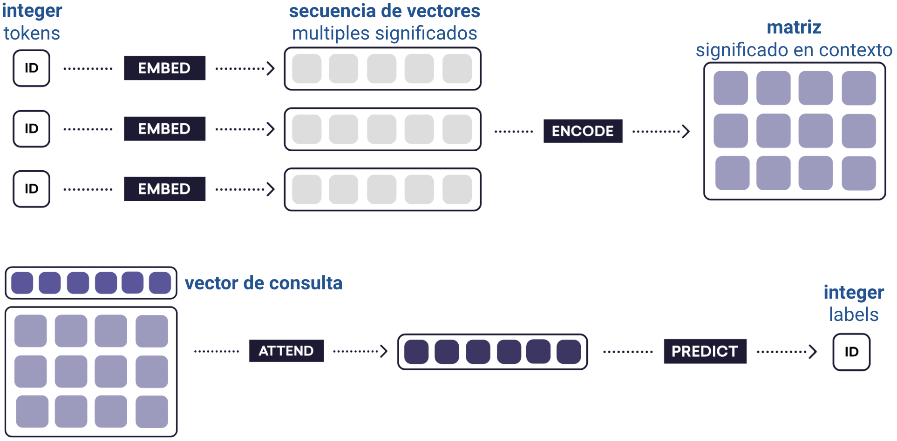
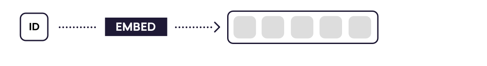
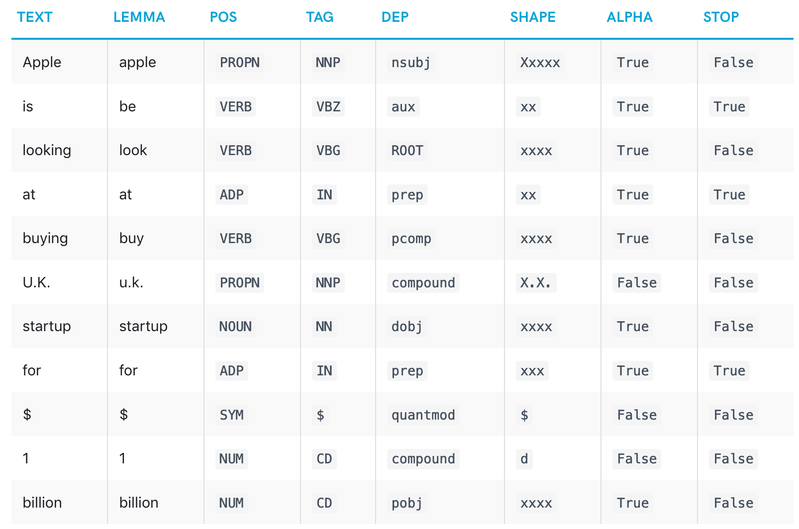

\newpage
# Estado del arte {#state-of-art}

El análisis del estado del arte fue basado en la definición del problema.

## Stack de software

Python es el lenguaje más utilizado para resolver problemas de Machine Learning, en especial NLP [@github_machine_learning]

Spacy es el framework mejor ranqueado para la tarea de NLP [@github_machine_learning] y sabemos por la Figura \@ref(fig:spacy-algos) que obtiene resultados a-la-par del estado del arte actual.

Además la implementación de spacy es robusta y orientada a la creación de apliciones para producción, a diferencia de muchas otras librerías de NLP que sólo se utilizan con fines académicos.

## El pipeline

Todas las operaciones de analisis de lenguaje natural sobre textos no estructurados, tienen como primer paso el de separar el los mismos en tokens. Luego, el documento se procesa en varios pasos diferentes que consisten en el "pipeline de procesamiento". Usualmente los pasos consisten en un etiquetador, un analizador sintáctico y un reconocedor de entidades en el caso de NER.

Cada componente del pipeline devuelve el Doc procesado, que luego se pasa al siguiente componente.

```{r spacy-pipeline, echo = FALSE, fig.pos="H", fig.align = 'center', fig.cap='Pipeline standard para los algoritmos de NER'}
knitr::include_graphics('assets/spacy_pipeline.png')
```

En este capítulo esturiaremos la morfología de dicho pipeline.

## Algoritmo de tokenización

Para tokenizar un texto de manera correcta no basta con separar el mismo en espacios. Dependiendo el lenguaje que se esté estudiando, existen "excepciones" a esta regla y otros caracteres que representan separaciones entre tokens segun el contexto de los mismos.

En particular, spaCy posee algoritmo de tokenización inteligente que puede ser resumido de la siguiente manera:

1. Iterar sobre subcadenas separadas por espacios en blanco.
2. Compruebar si existe una regla definida explícitamente para esta subcadena. Si existe, usarla.
3. De lo contrario, intentar consumir un prefijo. Si consumimos un prefijo, regrese al punto#2, para que los casos especiales siempre tengan prioridad.
4. Si no se puede consumir un prefijo, intente consumir un sufijo y luego regrese al punto #2.
5. Si no se puede consumir un prefijo ni un sufijo, buscar un caso especial.
6. Buscar una coincidencia de token
7. Buscar "infijos" - cosas como guiones, etc. y dividir la subcadena en tokens en todos los infijos.
8. Una vez que no se pueda consumir más de la cadena, tratarla como un token único.

Ejemplo:

```{r spacy-tokenization, echo = FALSE, fig.pos="H", fig.align = 'center', fig.cap='Transiciones del modelo Stack-LSTM indicando la acción aplicada y el estado resultante.'}
knitr::include_graphics('assets/spacy_tokenization.png')
```

## Modelos basados en reglas

Antes de entrar en detalles de cómo trabaja el modelo estadístico de spacy y entender sus fortalezas es importante esbozar brevemente el grupo de algorítmos más "naive" posible. El de los modelos basados en reglas fijas.

En estos modelos se implementan reglas finitas o expresiones regulares para la detección de las entidades. Las principales limitaciones de este enfoque son:

* **Mucho trabajo manua**l: el sistema RB exige un profundo conocimiento del dominio, este analisis debe ser realizado por humanos expertos en el dominio.
* **Consumo de tiempo**: la generación de reglas para un sistema complejo es bastante difícil y requiere mucho tiempo.
* **Menor capacidad de aprendizaje**: el sistema generará el resultado según las reglas, por lo que la capacidad de aprendizaje del sistema por sí mismo es baja.
* **Dominios complejos**: si el corpus demasiado complejo, la creación del sistema RB puede llevar mucho tiempo y análisis. La identificación de patrones complejos es una tarea desafiante en el enfoque RB.

## Modelos de "_deep-learning_"

Cuando se busca mejorar el aprendizaje automático, generalmente se piensa en la eficiencia y la precisión, pero la dimensión más importante es la generalidad. Este es el modelo estadístico que usa spaCy.

La mayoría de los problemas de `NLP` pueden reducirse a problemas de aprendizaje automático que toman uno o más textos como entrada. Si podemos transformar estos textos en vectores, podemos reutilizar soluciones de aprendizaje profundo (_deep-learning_) de propósito general.

Las representaciones de palabras embebidas (_embebed-words_), también conocidas como "vectores de palabras" (_word-vectors_), son una de las tecnologías de procesamiento de lenguaje natural más utilizadas en el estado del arte actual. El modelo de deep learning utilizado por spaCy puede ser descripto en 4 pasos.

Los _word-embeddings_ permiten tratar a las palabras individuales como _unidades de significado_, en lugar de identificaciones completamente distintas. A este proceso se le conoce como **_embed_.**

Sin embargo, la mayoría de los problemas de _NLP_ requieren la comprensión de tramos de texto más largos, no solo palabras individuales. Al juntar un conjunto de _word-embeddings_ en una secuencia de vectores, se usan RNN bidireccionales para codificar los vectores en una matriz de oración. Las filas de esta matriz pueden entenderse como _vectores-de-tokens_: son sensibles al contexto del token dentro de la oración. Este paso se lo llama **__encode__**

Finalmente mecanismo de **__attend__** le permite reducir la matriz de oración a un vector de oración, listo para la predicción (**__predict__**).

De esta manera quedan definidas las piezas que describen al modelo de spacy:

```{r formula-shapes, echo = FALSE, fig.pos="H", fig.align = 'center', fig.cap='Estados posibles para las diferentes etapas de la CNN'}

```

Estos 4 procesos seran descriptos en detalle en las siguientes secciones.

### embed
> Resuelve el problema: "todas las palabras se ven iguales para la computadora"

La idea de _word embeddings_ es la de "embeber" el conjunto de  tokens que componen términos con información adicional. El resultado de esta operacion es una estructura abstracta que puede ser descripta como un "vector de significado".

```{r formula-embed, echo = FALSE, fig.pos="H", fig.align = 'center', fig.cap='embed'}

```

Es importante destacar que en esta etapa de _embed_; toda la información de significado es principalmente independiente del contexto en el cual esta siendo utilizada y por esta razon es facilmente obtenible del corpus no tagueado de datos (los algoritmos pueden darse cuenta de que palabras estan relacionadas entre si de manera eficiente y no supervisada)

Esto permite al modelo poder inferir significado a partir de información no tagueada dentro del problema en particular a resolver (el de NER).

Una tabla de _word-embeddings_ mapea vectores largos binarios y esparsos en vectores cortos densos y continus, llenos de significado relevante. Existen varias estrategias para "infusionar" tokens con información adicional. Las dos fuentes mas grandes de información embebida más importantes son las de _información ligúistica_ y los _word-vectors_.

#### Información ligúistica

El objetivo de esta etapa es la de encontrar las características intrínsecas de cada palabra. Las principales características lingúisticas detectadas estan resumidas en el siguiente ejemplo:

```{r formula-pos, echo = FALSE, fig.pos="H", fig.align = 'center', fig.cap='características lingúisticas'}

```

* **Text**: la palabra original texto.
* **Lemma**: La forma básica de la palabra. `Es -> ser`. Esto permite a las siguientes etapas trabajar con una definicón canónica del token.
* **POS**: la etiqueta simple de parte-del-discurso (POS).
* **Tag**: la etiqueta detallada de parte del discurso (POS).
* **Dep**: dependencia sintáctica, es decir, la relación entre tokens.
* **Shape**: la forma de la palabra: mayúsculas, puntuación, dígitos. Muy util para detectar patrones como números telefónicos, documentos de identidad, CBUs, etc.
* **is alpha**: ¿el token es una secuencia de caracteres alfabéticos?
* **is stop** : ¿es el token parte de una lista de palabras-de-stop, es decir, las palabras más comunes del idioma?

##### Word Vectors

A diferencia de la información lingúistica que es obtenida en el momento. Existen otro tipo de embeddings más poderosos que son producto de preentrenamientos. Tal es el caso de los _word-vectors_. Los vectores de palabras se aprenden mediante la concatenación de incrustaciones de atributos léxicos NORM, PREFIX, SUFFIX y SHAPE. Luego se usa una capa oculta centro de una red neuronal convolucional (CNN) para permitir una combinación no lineal de la información en estos vectores concatenados.

Los vectores de palabras son particularmente útiles para términos que no están bien representados en los datos de entrenamiento etiquetados. En nuestro uso de reconocimiento de entidades, siempre habrá muchos nombres de los que no se tendrán ejemplos. Por ejemplo, en los datos de entrenamiento es posible que existan algunos ejemplos del término "Coca-Cola", pero ninguno que contenga el término "Manaos".
Es interesante pensar a las palabras como "vectores de significado". Dentro del espacio vectorial de significados el vector "perro" se encuentra cercano al de "cachorro", "beagle", "bulldog", "poodle". Esto permite al modelo poder inferir nuevas relaciones en base a una cantidad reducida de input.
Los vectores de palabras ponen ese hecho a disposición del modelo de reconocimiento de entidades. Si bien no existen ejemplos de "Manaos" etiquetados como "Producto"; se verá que "Manaos" tiene un vector de palabras que generalmente corresponde a los términos de un producto, por lo que puede hacer la inferencia. Y si se quiere llegar incluso al detalle de que es una Gaseosa.

Otra forma interesante de analizar y entender los word-vectors en su contexto de espacio vectorial multidimensional de significados es a través del algebra de vectores, como se muestra en el Paper "Towards Understanding Linear Word Analogies" [@ethayarajh-etal-2019-towards]:

```{r vec-parallelogram, echo = FALSE, fig.pos="H", fig.align = 'center', fig.cap='Parallelogram structure in the vector space (by definition)'}
knitr::include_graphics('assets/parallelogram.png')
```

Es facil de entender viendo ese paralelogramo que al realizar algebra entre los diferentes vectores de significado se pueden inferir nuevos conceptos:

$$\vec{Rey} - \vec{Hombre} \approx \vec{Realeza}$$
$$\vec{Rey} - \vec{Hombre} + \vec{Mujer} \approx \vec{Reina}$$

### encode
> Resuelve el problema: el contexto de los significados es relevante y esta siendo descartado

El resultado de esta etapa es la de encodear vectores **independientes-de-contexto** en matrices de oración **sensibles-al-contexto**

```{r formula-encode, echo = FALSE, fig.pos="H", fig.align = 'center', fig.cap='encode'}
knitr::include_graphics('assets/deep-learning-formula-nlp_encode.svg')
```

La tecnología utilizada para esta etapa es una Red Neuronal Convolucional en la que la oración es analizando como una _moving window_ de 3 vectores en la que cada vector analiza su significado en relación con un vector previo y un vector posterior. Es decir cada vector se estudia dentro del contexto de los dos vectores que lo rodean. Luego los vectores subsiguientes se evaluan de igual manera. Por lo que se genera naturalmente un _efecto de decaimiento_ en el que el contexto de los vectores más lejanos tiene una relevancia cada vez menor. 

### attend
> Resuelve el problema: tenemos demasiada información para inferir un significado específico al problema a resolver

En esta etapa toda la información generada en las etapas anteriores es analizada a través de un vector de entrada o tambien conocido como _vector de consulta_ o _vector de contexto_ representado en la siguiente figura como un vector mas oscuro.

```{r formula-attend, echo = FALSE, fig.pos="H", fig.align = 'center', fig.cap='attend'}
knitr::include_graphics('assets/deep-learning-formula-nlp_attend.svg')
```

Al reducir la matriz a un vector, necesariamente se está perdiendo información. Es por eso que el _vector de contexto_ es crucial: le dice qué información descartar, de modo que el vector "resumen" se adapte a la red que lo consume.

El análisis de estas estrategias de consulta escapa el alcance de este trabajo pero resulta un tema interesante de investigación en si mismo. Por ejemplo; investigaciones recientes han demostrado que el mecanismo de atención es una técnica flexible y que se pueden usar nuevas variaciones para crear soluciones elegantes y poderosas. Por ejemplo, en [@parikh-etal-2016-decomposable] presentan un mecanismo de atención que toma dos matrices de oraciones y genera un solo vector.

### predict
> Resuelve el problema: necesito un valor específico y no una representación genérica abstracta

Finalmente en esta etapa tenemos un nuevo _vector de significado_ que resulta de la query de al etapa anterior. Necesitamos ahora traducir este _vector_ a un token efectivo. En el caso de NER el token que nos interesa obtener es el de que etiqueta de entidad es la que corresponde a esta tarea.

```{r formula-predict, echo = FALSE, fig.pos="H", fig.align = 'center', fig.cap='predict'}
knitr::include_graphics('assets/deep-learning-formula-nlp_predict.svg')
```

## Usando el modelo estadístico

Experimentos en inglés, holandés, alemán y español muestran que se pueden obtener resultados a-la-par del estado del arte utilizando un autómata finito determinístico de pila en conjunción con una red neuronal [@DBLP:journals/corr/LampleBSKD16]. En particular la red neuronal del modelo estadístico estudiado en la sección anterior.

Este autómata de pila es el nexo entre la Red Neuronal Convolucional (CNN) que contiene el modelo estadístico para predecir entidades y el texto completo. No se envía el texto entero como input a dicha red, sino que se van enviando cada uno de los estados en los que el autómata de pila se mueve para ir generando entidades con una herística del tipo _greedy_.

Las posibles acciones de transición de este autómata son las siguientes:

```{r lampe-1, echo = FALSE, fig.pos="H", fig.align = 'center', fig.cap='Transiciones del modelo Stack-LSTM indicando la acción aplicada y el estado resultante.'}
knitr::include_graphics('assets/lampe_1.png')
```

* SHIFT: consume una token del input y al mueve al stack para generar una nueva entidad.
* REDUCE: mueve el stack actual al output tagueado como entity.
* OUT: consume una token del input y la mueve sl output directamente.

Para saber que acción tomar se consulta el modelo estadístico.En la siguiente figura se puede ver un ejemplo de cómo se recorre una oración bajo el stack propuesto:

```{r lampe-2, echo = FALSE, fig.pos="H", fig.align = 'center', fig.cap='Secuencia de tranciciones para el ejemplo "Mark Watney visited Mars" en el modelo de Stack-LSTM.'}
knitr::include_graphics('assets/lampe_2.png')
```

* Primero se empieza con un stack vacío.
* Se consume "Mark" y la CNN predice que es una posible Persona. Lo envia al stack.
* Se consume "Watney" y la CNN predice que es una posible continuación de Persona. Lo envia al stack.
* Se consume "visited" y la CNN predice que esto no forma parte de una entidad. Por lo tanto antes se REDUCE la entidad "Mark Watney" del stack actual.
* Análogamente se detecta la entidad "Mars"
