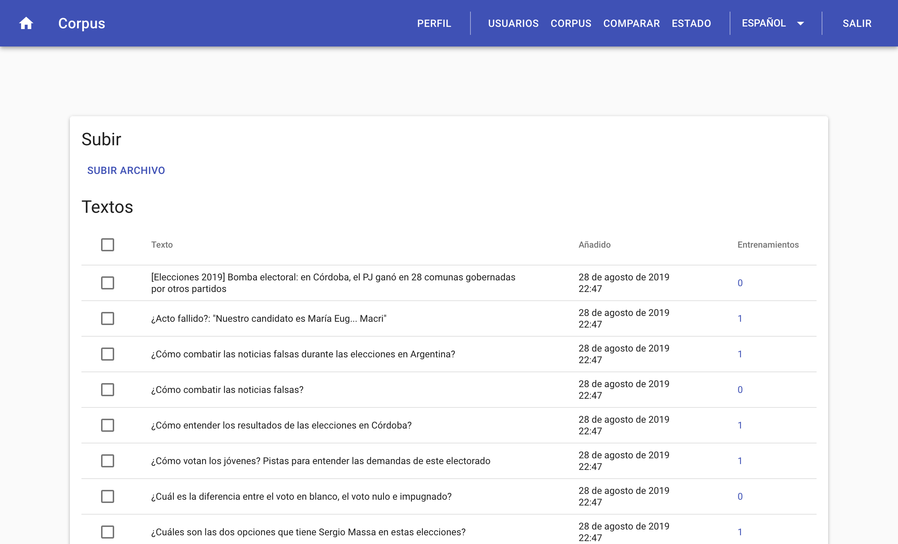

\newpage
# NERd (Implementación) {#implementation}

Definido el problema, queda claro que la creación de un modelo entrenado es de vital importancia para cualquier problema de tagueo de entidades.
Es por ello que en el presente proyecto final hemos creado una herramienta para el entrenamiento eficiente de modelos estadísticos así como también una interfaz y API para poder consultar entidades.
El nombre de esta herramienta es **NERd**, sigla cuyo significado en inglés es _**N**amed **E**ntity **R**ecognition **D**uh_^[Expresión de obviedad. _Used to express your belief that what was said was extremely obvious_ [@cambridge_duh]]!

Para organizar este capítulo vamos a realizar una descripción basada en el modelo de vistas de arquitectura 4+1.

```{r arq41, echo = FALSE, fig.pos="H", fig.align = 'center', fig.cap='Ilustración de arquitectura 4+1'}
knitr::include_graphics('assets/4+1_Architectural_View_Model.svg')
```

Este modelo nos permite describir la aplicación de una manera genérica y ordenada.

> _The “4+1” view model is rather “generic”: other notations and tools can be used, other design methods can be used, especially for the logical and process decompositions, but we have indicated the ones we have used with success._
>
> `r tufte::quote_footer('--- [@Kruchten:1995:VMA:624610.625529]')` 

## Vista lógica

> La vista lógica se refiere a la funcionalidad que el sistema proporciona a los usuarios finales.

A continuación detallamos distintas partes del servicio NERd así como también de la interfaz de entrenamiento.

<!-- Los diagramas UML se utilizan para representar la vista lógica e incluyen diagramas de clase y diagramas de estado. -->
### Web

La página web de _NERd_ está enfocada en las tareas de mantenimiento de los servicios ofrecidos por el _API_ así como también ofrece de interfaces que permiten a usuarios del sistema corregir de manera eficiente el modelo de inferencia.

#### Inicio

Pantalla de inicio donde se encuentran accesos rápidos para entrenar el modelo o para poder buscar entidades en textos.
También se encuentra aquí una lista de los 5 usuarios que más contribuyeron a entrenar el modelo. Detrás de esta funcionalidad se busca generar un espíritu competitivo entre los usuarios para que los mismos busquen contribuir más.

```{r logic-home, echo = FALSE, fig.pos="H", fig.align = 'center', fig.cap='Pantalla de inicio con usuario logueado'}
knitr::include_graphics('assets/logic/home-logged-all.png')
```
Si la persona no cuenta con permisos de entrenador, se le sugiere que contacte a un administrador para que le otorgue el permiso.

```{r logic-home-logged-nontrainer, echo = FALSE, fig.pos="H", fig.align = 'center', fig.cap='Pantalla de inicio sin rol de entrenador'}
knitr::include_graphics('assets/logic/home-logged-not_trainer.png')
```

Si la persona visitando la página no cuenta con una sesión activa, se le invita a ingresar con una cuenta pre-existente o a registrarse.

```{r logic-home-anonymous, echo = FALSE, fig.pos="H", fig.align = 'center', fig.cap='Pantalla de inicio sin sesión'}
knitr::include_graphics('assets/logic/home-anonymous.png')
```

#### Entrenamiento

La pantalla de _Entrenamiento_ es el núcleo de la web en la cual es posible entrenar el modelo.

El usuario es presentado con un texto perteneciente al Corpus del servicio con las entidades inferidas por el modelo actual. Con un editor especial, le permitimos al usuario poder corregir las entidades inferidas y enviarle la corrección al servicio. Esa corrección será utilizada posteriormente a la hora de mejorar el modelo actual.

```{r logic-train, echo = FALSE, fig.pos="H", fig.align = 'center', fig.cap='Pantalla de entrenamiento'}
knitr::include_graphics('assets/logic/train.png')
```

##### Usabilidad

Tuvimos un foco fuerte en la usabilidad del widget ya que los entrenadores del servicio van a pasar prácticamente todo su tiempo en ésta pantalla, por lo que se tuvieron las siguientes consideraciones en la implementación.

###### Llamado a acción y ayuda

Dado que lo primero que ve el usuario es un texto con anotaciones, agregamos un título que invita al usuario a realizar acciones sobre el texto. De esta manera, le mostramos las dos acciones principales realizables desde el widget de entrenamiento: Click en alguna palabra o entidad y arrastrar un conjunto de palabras para crear una entidad nueva.
Como refuerzo de este llamado a acción, agregamos un botón que al ser clickeado muestra un mensaje de ayuda con instrucciones más detalladas sobre el objetivo del entrenador y las acciones que deben de realizarse sobre el mismo.

```{r logic-train-help, echo = FALSE, fig.pos="H", fig.align = 'center', fig.cap='Ayuda del entrenador'}
knitr::include_graphics('assets/logic/train-help.png')
```

###### Creación y edición de entidades

Para la creación de entidades decidimos ofrecer dos maneras: La primera es arrastrando un conjunto de palabras de manera tal de unirlas todas en una única entidad.
La otra es hacer click en una palabra y ahí se ofrecen opciones dependiendo de la ubicación de la palabra dentro del texto:

- Si no existen entidades en el texto actual, se le asigna por defecto el tipo _MISC_ y se muestran el resto de los tipos para permitir cambiarlo de ser necesario.
- Si existen entidades antes o después, se ofrece la opción de unir la palabra actual con la entidada más próxima para el lado elegido.

```{r logic-train-popup, echo = FALSE, fig.pos="H", fig.align = 'center', fig.cap='Edición de entidad'}
knitr::include_graphics('assets/logic/train-popup.png')
```

Para la edición de entidades decidimos permitir únicamente la modificación del tipo de una entidad inferida.
Si el modelo infirió una entidad de manera incorrecta, ya sea por que sea una entidad inválida o agregó palabras de más a una entidad inválida, permitimos que el usuario remueva la entidad y que después vuelva a agregar la entidad correcta.

###### Optimización en tiempos de carga

Dado que es esperado que un usuario entrene más de un texto, al momento de pedir un texto para mostrar, se pide el siguiente. Mediante este mecanismo de pre-carga, podemos eliminar el tiempo de espera entre texto y texto ofreciendo al usuario una experiencia completamente fluida.

#### Administración de usuarios

La pantalla de _Administración de usuarios_ permite a los usuarios con el rol de administrador poder modificar los roles de todos los usuarios del sistema, borrarlos o acceder a los detalles del usuario, tal como la lista de textos entrenados.

```{r logic-user-list, echo = FALSE, fig.pos="H", fig.align = 'center', fig.cap='Administración de usuarios'}
knitr::include_graphics('assets/logic/user-list.png')
```

#### Detalles de usuario

La pantalla de detalle de usuario permite al usuario con sesión activa ver sus entrenamientos y cambiar su contraseña.

Los usuarios con rol administrador pueden realizar las acciones mencionadas previamente pero a otros usuarios.

```{r logic-user-profile, echo = FALSE, fig.pos="H", fig.align = 'center', fig.cap='Perfil de usuario'}
knitr::include_graphics('assets/logic/user-profile.png')
```

#### Corpus

La pantalla de _Corpus_ permite a un usuario con el rol de administrador realizar tareas relacionadas con el corpus del sistema.

```{r logic-corpus-management, echo = FALSE, fig.pos="H", fig.align = 'center', fig.cap='Administración de corpus'}

```

Desde aquí es posible agregar textos al corpus utilizando la funcionalidad de subida de archivos. Los archivos deben ser archivos con extensión _.txt_ y cada línea del archivo será agregada al corpus como un texto individual.

También es posible desde aquí ver todos los textos que forman parte del corpus así como también poder ver los entrenamientos para cada uno de los textos. Finalmente, es posible quitar textos del corpus así como también es posible eliminar correcciones a las inferencias de entidades cargados por usuarios.

#### Estado

La pantalla de _Estado_ permite a un usuario con el rol de administrador visualizar el estado de entrenamiento del corpus así como también realizar diversas acciones sobre los _workers_.

```{r logic-status, echo = FALSE, fig.pos="H", fig.align = 'center', fig.cap='Información de corpus y manejo de workers'}
knitr::include_graphics('assets/logic/status.png')
```

##### Secciones

###### Corpus

Es la columna la izquierda y aquí se puede ver rápidamente que porcentaje de el corpus contiene correcciones por usuarios así como también saber la cantidad total de correcciones del sistema (un texto puede tener más de una corrección por distintos usuarios) y también presenta un botón que permite al administrador ir a la pantalla de _Corpus_.

###### Crear snapshot

Es la sección en la cual será posible crear, borrar o modificar los tipos de entidades reconocidos por el snapshot actual. La acción de editar las entidades genera un snapshot nuevo.

Si el administrador así lo quisiera, puede utilizar esta sección para crear un snapshot nuevo sin editar entidades.

###### Snapshots

Sección en la cual podemos ver la lista completa de snapshots.
Para cada Snapshot, se muestra cuando fue la última vez que se entrenó así como también cuantos trabajadores tiene asignados. Finalmente es posible desde aquí forzar a entrenar el modelo para ese snapshot en particular y también se presenta la opción para desentrenar, borrando el modelo guardado en el disco.

###### Reasignar trabajador

Sección que permite reasignar trabajadores para que sirvan un snapshot distinto. De esta manera se pueden servir distintas versiones del modelo de inferencia para poder realizar distintas pruebas sobre los mismos.


#### Sandbox

La pantalla de _Sandbox_ permite a los usuarios hacer consultas al servicio NERd para poder obtener entidades nombradas a partir de textos arbitrarios.
Adicionalmente, si el usuario tiene el rol de entrenador, podrá corregir las entidades inferidas y agregar el texto con sus correcciones al corpus.

```{r logic-sandbox, echo = FALSE, fig.pos="H", fig.align = 'center', fig.cap='Inferencia de entidades en sandbox'}
knitr::include_graphics('assets/logic/sandbox.png')
```

#### Comparar

Sección accesible únicamente a administradores en la que es posible comparar las entidades inferidas por dos modelos distintos. A su vez, si el usuario logueado tiene el permiso de entrenador, es posible corregir de manera inline los errores en la inferencia del modelo actual.

```{r logic-compare, echo = FALSE, fig.pos="H", fig.align = 'center', fig.cap='Comparativa de modelos'}
knitr::include_graphics('assets/logic/compare.png')
```

#### Registración

Sección únicamente accesible cuando no hay una sesión activa. Aquí se registran los usuarios con la opción de que el inicio de sesión persista luego de que se cierre la pestaña del navegador.

```{r logic-registration, echo = FALSE, fig.pos="H", fig.align = 'center', fig.cap='Registración'}
knitr::include_graphics('assets/logic/register.png')
```

#### Login

Sección únicamente accesible cuando no hay una sesión activa. Aquí ingresan los usuarios al sistema con la opción de que el inicio de sesión persista luego de que se cierre la pestaña del navegador.

```{r logic-login, echo = FALSE, fig.pos="H", fig.align = 'center', fig.cap='Inicio de sesión'}
knitr::include_graphics('assets/logic/login.png')
```

#### Barra de navegación

La barra de navegación muestra distinta información dependiendo del contexto actual del sistema.

Cuando no hay una sesión activa, se muestran únicamente las opciones para acceder al sistema, ya sea registrándose o ingresando utilizando credenciales.

```{r logic-status-anonymous, echo = FALSE, fig.pos="H", fig.align = 'center', fig.cap='Usuario anónimo'}
knitr::include_graphics('assets/logic/status-anonymous.png')
```

Cuando hay una sesión activa el usuario cuenta con el rol de _USER_ y/o de _TRAINER_ pero **no** con el de _ADMIN_, debería poder acceder únicamente a su perfil.

```{r logic-status-user, echo = FALSE, fig.pos="H", fig.align = 'center', fig.cap='Usuario regular'}
knitr::include_graphics('assets/logic/status-user.png')
```

Finalmente, cuando el usuario logueado tiene el rol de _ADMIN_, tiene acceso a todas las secciones de administración del sistema.

```{r logic-status-admin, echo = FALSE, fig.pos="H", fig.align = 'center', fig.cap='Usuario administrador'}

```

### Servicio

El acceso al servicio se realiza mediante un API REST que se auto-documenta debido a implementar la especificación de OpenAPI. A continuación detallamos los endpoints.

#### Autenticación

Rutas del API dedicadas a la autenticación de usuarios.

* **POST** _/api/auth/register_
    * Registrar un usuario nuevo.

* **POST** _/api/auth/token_
    * Genera un nuevo token de acceso y refresco con credenciales.
    * Utilizado para la funcionalidad de _login_
* **POST** _/api/auth/refresh_
    * Refresca el token de acceso.
    * Utilizado cuando un token de acceso caducó.

#### Usuarios

Conjunto de operaciones relacionadas con los usuarios del sistema.

* **GET** _/api/users_
    * Lista de usuarios existentes
    * Separa los resultados en páginas
* **GET** _/api/users/top5_
    * Lista de los 5 usuarios con más entrenamientos
* **GET** _/api/users/me_
    * Retorna la información del usuario logueado
* **PATCH** _/api/users/me_
    * Actualiza la información del usuario logueado
* **GET** _/api/users/me/trainings_
    * Retorna los entrenamientos del usuario logueado
    * Separa los resultados en páginas
* **GET** _/api/users/\{user\_id\}_
    * Retorna la información del usuario especificado por _user\_id_
* **PATCH** _/api/users/\{user\_id\}_
    * Actualiza la información del usuario especificado por _user\_id_
* **DELETE** _/api/users/\{user\_id\}_
    * Borra al usuario especificado por _user\_id_
* **GET** _/api/users/\{user\_id\}/trainings
    * Retorna los entrenamientos del usuario especificado

#### Roles

* **GET** _/api/roles_
    * Retorna la lista de todos los roles asignables a usuarios del sistema

#### Corpus

Rutas dedicadas a operaciones con el corpus del sistema.

* **GET** _/api/corpus/\{text\_id\}_
    * Retorna los detalles del texto especificado por _text\_id_
* **DELETE** _/api/corpus/\{text\_id\}_
    * Borra un texto especificado por _text\_id_ del corpus
* **GET** _/api/corpus/\{text\_id\}/trainings_
    * Retorna la lista de entrenamientos proporcionados por los usuarios sobre las entidades en el texto
* **PUT** _/api/corpus/\{text\_id\}/trainings_
    * Agrega un entrenamiento para el texto con id _text_id_
* **POST** _/api/corpus/upload_
    * Permite agregar textos de manera masiva al sistema
    * Acepta una lista de archivos .txt donde cada línea es un texto a agregar
    * Los archivos deben ser UTF-8
* **GET** _/api/corpus_
    * Lista de textos cargados en el sistema para entrenamiento
    * Separa los resultados en páginas
* **POST** _/api/corpus_
    * Agrega un texto al sistema para entrenamiento

#### Snapshots

Conjunto de operaciones relacionadas con los snapshots y workers.

* **GET** _/api/snapshots_
    * Listado de los snapshots disponibles
    * Separa los resultados en páginas
* **GET** _/api/snapshots/\{snapshot_id}_
    * Retorna información (tipos de entidades, fecha de creación, fecha de entrenamiento, etc.) sobre un snapshot específico
* **DELETE** _/api/snapshots/\{snapshot_id}_
    * Borra un snapshot con el id especificado
* **POST** _/api/snapshots/\{snapshot_id}/force-train_
    * Envía la tarea de entrenamiento a los workers que tienen el snapshot _snapshot_id_ cargado.
* **POST** _/api/snapshots/\{snapshot_id}/force-untrain_
    * Envía la tarea de desentrenar a los workers que tienen el snapshot _snapshot_id_ cargado.
* **GET** _/api/snapshots/current_
    * Retorna información sobre el snapshot actual
* **PUT** _/api/snapshots/current_
    * Crea un nuevo snapshot con la información provista

#### Reconocimiento de Entidades Nombradas

Conjunto de operaciones relacionadas al _Reconocimiento de Entidades Nombradas_

* **GET** _/api/ner/train_
    * Retorna un texto para que un usuario del sistema revise si está correctamente inferido
    * Únicamente retorna textos que el usuario logueado no haya corregido ya
* **GET** _/api/ner/compare/\{first_snapshot\}/\{second_snapshot\}_
    * Compara el _Reconocimiento de Entidades Nombradas_ entre dos snapshots distintos
* **POST** _/api/ner/current/parse_
    * Retorna un documento Spacy para un texto dado utilizando el snapshot actual
* **POST** _/api/ner/\{snapshot_id\}/parse_
    * Retorna un documento Spacy para un texto dado utilizando el snapshot especificado
* **POST** _/api/ner/current/entities_
    * Retorna la lista de _Entidades Nombradas_ para un texto dado utilizando el modelo actual
* **POST** _/api/ner/\{snapshot_id\}/entities_
    * Retorna la lista de _Entidades Nombradas_ para un texto dado utilizando el modelo especificado

#### Entrenamientos

* **DELETE** _/api/trainings/\{training_id\}_
    * Borra un entrenamiento

#### Workers

* **GET** _/api/workers/_
    * Lista de los workers disponibles
* **POST** _/api/workers/reassign_
    * Reasigna un trabajador de un a versión de snapshot a otra

## Vista de proceso
> La vista de proceso trata los aspectos dinámicos del sistema, explica los procesos del sistema y cómo se comunican, y se centra en el comportamiento del sistema en tiempo de ejecución.
La vista de proceso aborda concurrencia, distribución, integradores, rendimiento y escalabilidad, etc.

Existen cinco procesos que juntos forman la totalidad de NERd y su entrenador.

```{r process-overview-client, echo = FALSE, fig.pos="H", fig.align = 'center', fig.cap='Componentes del sistema'}
knitr::include_graphics('assets/process/process-overview-client.png')
```

### API

Servicio en el cual los clientes pueden pedir las _Entidades Nombradas_ de textos así como también permite la carga de textos con sus respectivas correcciones que luego serán utilizadas para entrenar el modelo de inferencia.
El _API_ se comunica el servicio de _Bases de Datos_ para obtener o modificar información sobre los usuarios, los textos pertenecientes al corpus o información de los distintos _snapshots_ y con el _Task Scheduler_ para realizar diversas tareas relacionadas con _Spacy_.

### Task Scheduler

Recibe tareas desde el _API_ tales como reconocer entidades, entrenar y desentrenar un modelo, cambiar el modelo de un worker entre otras. Dado que su tarea es recibir tareas desde el _API_ y enviar y recibir mensajes de los _Workers_, debería existir una única instancia del mismo.
A su vez, notifica al _API_ la finalización de tareas asincrónicas

### Worker

Un _Worker_ se encarga de realizar el _Reconocimiento de Entidades Nombradas_ así como también de entrenar modelos de inferencia. Es un servicio que existe de manera independiente y necesita de dos otros servicios para funcionar:

* _Base de datos_ para obtener los datos necesarios para entrenar un modelo.
* _Task scheduler_ para poder recibir tareas.

Como el _Worker_ es una unidad de trabajo que recibe tareas desde el _Task Scheduler_, es posible tener varios _Workers_ donde cada uno utiliza un modelo de inferencia distinto (generados a partir de distintos snapshots).


### Database

Servicio que contiene la base de datos con la información necesaria (usuarios, snapshots) para que el servicio de API funcione así como también los datos necesarios por los workers (entrenamientos).

### Cliente

Es la interfaz del entrenador que se comunica con el API utilizando un SDK auto-generado a partir de la definición de _OpenAPI_. Implementado en este proyecto es un cliente web el cual permite explotar las funcionalidades de entrenamiento así como de inferencia de entidades


<!-- Los diagramas UML para representar la vista de proceso incluyen el diagrama de actividad. -->

<!-- TODO: explicar ui vs backend vs mensajes amq vs workers (no detalles de implementación ver siguiente) -->
<!-- TODO: Diagrama de actividad para contar procesos? O nah? -->

## Vista de desarrollo
> La vista de desarrollo ilustra un sistema desde la perspectiva de un programador y se ocupa de la gestión de software.
Esta vista también se conoce como la vista de implementación.
<!-- Utiliza el diagrama de componentes UML para describir los componentes del sistema. -->
<!-- Los diagramas UML utilizados para representar la vista de desarrollo incluyen el diagrama del paquete. -->

### Web

La página web que contiene la interfaz de administración así como también la de entrenamiento. Para implementarla decidimos utilizar el modelo de _Single Page Application_ que nos permitió generar un _bundle_ que puede ser hosteado en _CDNs_ y nos permite tener ciclos de release independientes al los del servicio.

Poder separar las releases de la web y el servicio es importante ya que los clientes del servicio no necesariamente necesitan de la web, ya que pueden acceder al servicio mediante el _API REST_ y una baja por cambios a la interfaz de la web no afecta la disponibilidad del servicio.

#### Tecnologías

Para la implementación utilizamos el lenguaje de programación llamado **Typescript**, lenguaje desarrollado por _Microsoft_ que compila a _JavaScript_ con el agregado de _Tipos_ que permiten producir código de mayor calidad debido al agregado de la posibilidad del chequeo estático de código para validar su correctitud.

Una vez definido el lenguaje, optamos por utilizar la librería llamada **ReactJS** [@react] desarrollada por _Facebook_ para implementar la interfaz.

Sumado a **ReactJS**, incluímos diversas librerías para poder resolver varios problemas en el desarrollo de una _SPA_:

##### Material UI
Provee de una biblioteca de componentes estilados siguiendo el patrón de diseño propuesto por _Google_ llamado _Material Design_. 

##### React Router
Desarrollada por _React Training_, proveé de mecanimos para la navegación en _SPAs_.

##### i18next
Librería que proveé mecanismos de internacionalización. A su vez, nos permitió generar los archivos de traducción mediante su extracción del código fuente utilizando la herramienta `i18next-scanner`.

##### OpenAPI Generator

_OpenAPI Generator_ es una herramienta que permite generar código a partir de una definición de _OpenAPI_.
Debido a que el servicio implementado expone una definiciión de _OpenAPI_, podemos utilizar ésta librería para auto-generar todo el código necesario para comunicarnos con el servicio usando el generador de _Typescript_.

<!-- TODO: explicar implementación de software ui y backend. Python, React, etc.-->
<!-- TODO: Hablar sobre Atributos de calidad de software -->


## Vista física
> La vista física representa el sistema desde el punto de vista de un ingeniero de sistemas.
Se refiere a la topología de los componentes de software en la capa física, así como a las conexiones físicas entre estos componentes.
Esta vista también se conoce como la vista de _deployment_.
<!-- Los diagramas UML utilizados para representar la vista física incluyen el diagrama de deployment. -->

<!-- TODO: explicar docker. docker-package. red. nginx. etc -->

## Escenarios
> La descripción de una arquitectura se ilustra utilizando un pequeño conjunto de casos de uso, o escenarios, que se convierten en una quinta vista.
> Los escenarios describen secuencias de interacciones entre objetos y entre procesos.
> Se utilizan para identificar elementos arquitectónicos y para ilustrar y validar el diseño de la arquitectura.
> También sirven como punto de partida para las pruebas de un prototipo de arquitectura.
> Esta vista también se conoce como vista de caso de uso. 

<!-- TODO: explicar algún caso de uso completo. Maybe el PF de pablo? -->

```{r results = 'asis', echo = FALSE}
DiagrammeR::DiagrammeR("
  sequenceDiagram;
   customer->>ticket seller: ask for a ticket;
   ticket seller->>database: seats;
   alt tickets available
     database->>ticket seller: ok;
     ticket seller->>customer: confirm;
     customer->>ticket seller: ok;
     ticket seller->>database: book a seat;
     ticket seller->>printer: print a ticket;
   else sold out
     database->>ticket seller: none left;
     ticket seller->>customer: sorry;
   end
")
```

