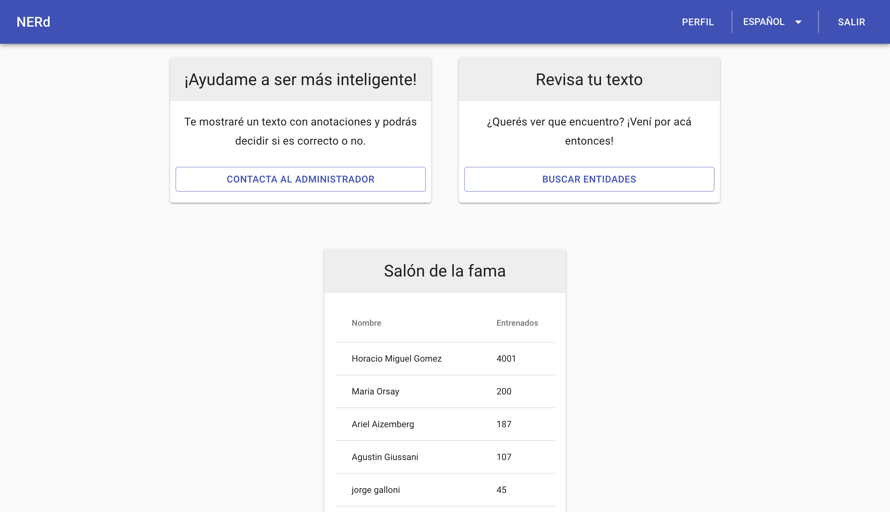
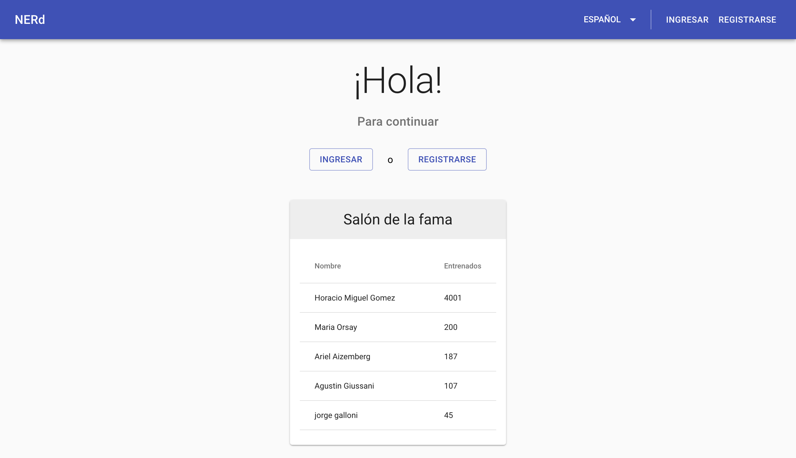
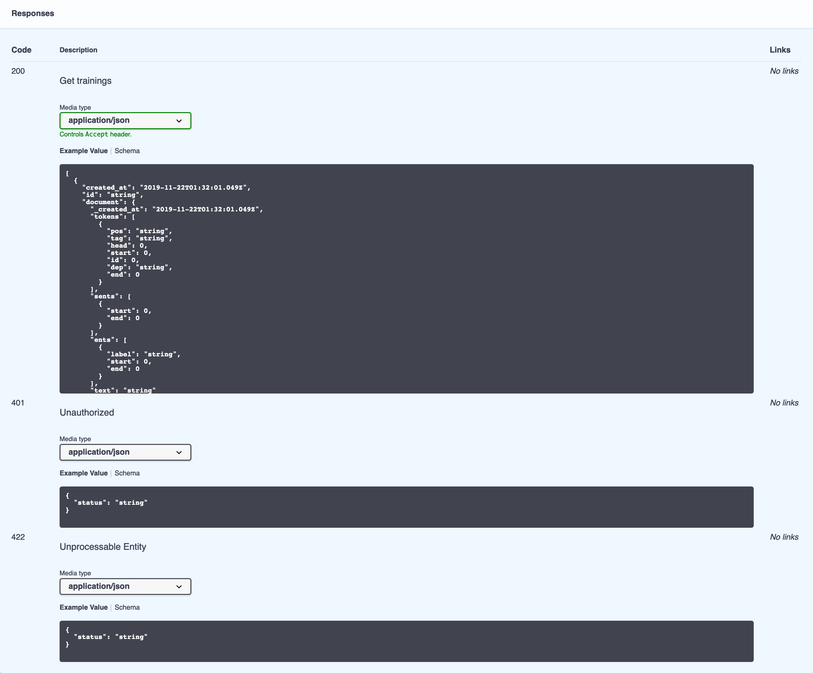
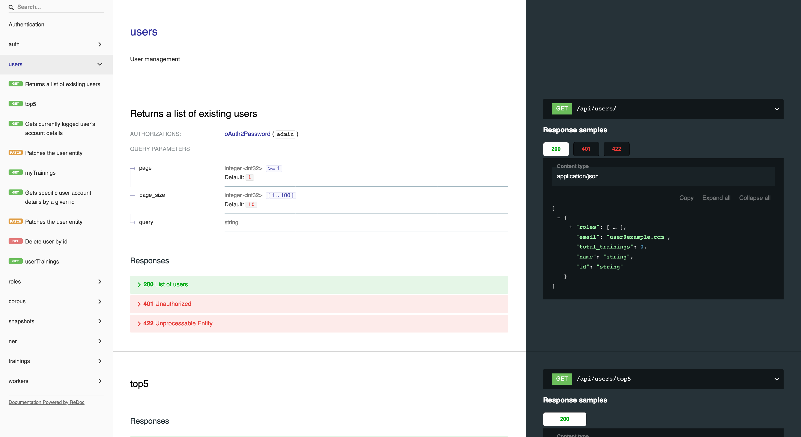
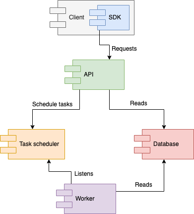
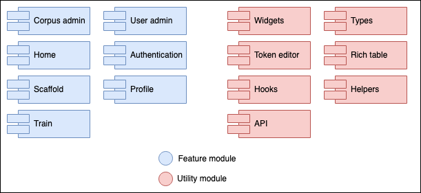
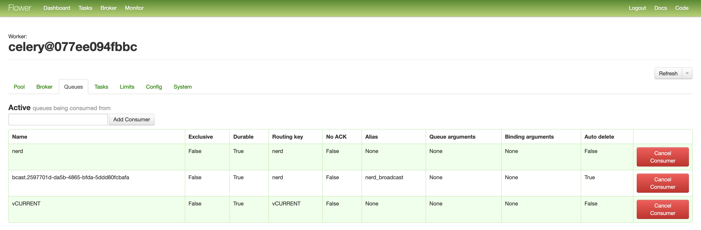

\newpage
# NERd (Implementación) {#implementation}

Definido el problema, queda claro que la creación de un modelo entrenado es de vital importancia para cualquier problema de tagueo de entidades.
Es por ello que en el presente proyecto final hemos creado una herramienta para el entrenamiento eficiente de modelos estadísticos así como también una interfaz y API para poder consultar entidades.
El nombre de esta herramienta es **NERd**, sigla cuyo significado en inglés es _**N**amed **E**ntity **R**ecognition **D**uh_^[Expresión de obviedad. _Used to express your belief that what was said was extremely obvious_ [@cambridge_duh]]!

Para organizar este capítulo vamos a realizar una descripción basada en el modelo de vistas de arquitectura 4+1 (Figura \@ref(fig:arq41).

```{r arq41, echo = FALSE, fig.pos="H", fig.align = 'center', fig.cap='Ilustración de arquitectura 4+1.'}
knitr::include_graphics('assets/4+1_Architectural_View_Model.svg')
```

Este modelo nos permite describir la aplicación de una manera genérica y ordenada.

> _The “4+1” view model is rather “generic”: other notations and tools can be used, other design methods can be used, especially for the logical and process decompositions, but we have indicated the ones we have used with success._
>
> `r tufte::quote_footer('--- [@Kruchten:1995:VMA:624610.625529]')` 

## Vista lógica

> La vista lógica se refiere a la funcionalidad que el sistema proporciona a los usuarios finales.

A continuación detallamos distintas partes del servicio NERd así como también de la interfaz de entrenamiento.

<!-- Los diagramas UML se utilizan para representar la vista lógica e incluyen diagramas de clase y diagramas de estado. -->
### Web

La página web de _NERd_ está enfocada en las tareas de mantenimiento de los servicios ofrecidos por el _API_ así como también ofrece de interfaces que permiten a usuarios del sistema corregir de manera eficiente el modelo de inferencia.

#### Inicio

Pantalla de inicio donde se encuentran accesos rápidos para entrenar el modelo o para poder buscar entidades en textos.
También se encuentra aquí una lista de los 5 usuarios que más contribuyeron a entrenar el modelo. Detrás de esta funcionalidad se busca generar un espíritu competitivo entre los usuarios para que los mismos busquen contribuir más (Figura \@ref(fig:logic-home)).

```{r logic-home, echo = FALSE, fig.pos="H", fig.align = 'center', fig.cap='Pantalla de inicio con usuario logueado.'}
knitr::include_graphics('assets/logic/home-logged-all.png')
```
Si la persona no cuenta con permisos de entrenador, se le sugiere que contacte a un administrador para que le otorgue el permiso (Figura \@ref(fig:logic-home-logged-notrainer)).

```{r logic-home-logged-nontrainer, echo = FALSE, fig.pos="H", fig.align = 'center', fig.cap='Pantalla de inicio sin rol de entrenador.'}

```

Si la persona visitando la página no cuenta con una sesión activa, se le invita a ingresar con una cuenta pre-existente o a registrarse (Figura \@ref(fig:logic-home-anonymous)).

```{r logic-home-anonymous, echo = FALSE, fig.pos="H", fig.align = 'center', fig.cap='Pantalla de inicio sin sesión.'}

```

#### Entrenamiento

La pantalla de _Entrenamiento_ es el núcleo de la web en la cual es posible entrenar el modelo.

El usuario es presentado con un texto perteneciente al _corpus_ del servicio con las entidades inferidas por el modelo actual. Con un editor especial, le permitimos al usuario poder corregir las entidades inferidas y enviarle la corrección al servicio. Esa corrección será utilizada posteriormente a la hora de mejorar el modelo actual (Figura \@ref(fig:logic-train)).

```{r logic-train, echo = FALSE, fig.pos="H", fig.align = 'center', fig.cap='Pantalla de entrenamiento.'}
knitr::include_graphics('assets/logic/train.png')
```

##### Usabilidad

Tuvimos un foco fuerte en la usabilidad del widget ya que los entrenadores del servicio van a pasar prácticamente todo su tiempo en ésta pantalla, por lo que se tuvieron las siguientes consideraciones en la implementación.

###### Llamado a acción y ayuda

Dado que lo primero que ve el usuario es un texto con anotaciones, agregamos un título que invita al usuario a realizar acciones sobre el texto. De esta manera, le mostramos las dos acciones principales realizables desde el widget de entrenamiento: Click en alguna palabra o entidad y arrastrar un conjunto de palabras para crear una entidad nueva.
Como refuerzo de este llamado a acción, agregamos un botón que al ser clickeado muestra un mensaje de ayuda con instrucciones más detalladas sobre el objetivo del entrenador y las acciones que deben de realizarse sobre el mismo (Figura \@ref(fig:logic-train-help)).

```{r logic-train-help, echo = FALSE, fig.pos="H", fig.align = 'center', fig.cap='Ayuda del entrenador.'}
knitr::include_graphics('assets/logic/train-help.png')
```

###### Creación y edición de entidades

Para la creación de entidades decidimos ofrecer dos maneras: La primera es arrastrando un conjunto de palabras de manera tal de unirlas todas en una única entidad.
La otra es hacer click en una palabra y ahí se ofrecen opciones dependiendo de la ubicación de la palabra dentro del texto:

- Si no existen entidades en el texto actual, se le asigna por defecto el tipo _MISC_ y se muestran el resto de los tipos para permitir cambiarlo de ser necesario.
- Si existen entidades antes o después, se ofrece la opción de unir la palabra actual con la entidada más próxima para el lado elegido.

```{r logic-train-popup, echo = FALSE, fig.pos="H", fig.align = 'center', fig.cap='Edición de entidad.'}
knitr::include_graphics('assets/logic/train-popup.png')
```

Como podemos ver en la figura \@ref(fig:logic-train-popup), para la edición de entidades decidimos permitir únicamente la modificación del tipo de una entidad inferida.
Si el modelo infirió una entidad de manera incorrecta, ya sea por que sea una entidad inválida o agregó palabras de más a una entidad inválida, permitimos que el usuario remueva la entidad y que después vuelva a agregar la entidad correcta.

###### Optimización en tiempos de carga

Dado que es esperado que un usuario entrene más de un texto, al momento de pedir un texto para mostrar, se pide el siguiente. Mediante este mecanismo de pre-carga, podemos eliminar el tiempo de espera entre texto y texto ofreciendo al usuario una experiencia completamente fluida.

#### Administración de usuarios

La pantalla de _Administración de usuarios_ permite a los usuarios con el rol de administrador poder modificar los roles de todos los usuarios del sistema, borrarlos o acceder a los detalles del usuario, tal como la lista de textos entrenados (Figura \@ref(fig:logic-user-list)).

```{r logic-user-list, echo = FALSE, fig.pos="H", fig.align = 'center', fig.cap='Administración de usuarios.'}
knitr::include_graphics('assets/logic/user-list.png')
```

#### Detalles de usuario

La pantalla de detalle de usuario permite al usuario con sesión activa ver sus entrenamientos y cambiar su contraseña.

Los usuarios con rol administrador pueden realizar las acciones mencionadas previamente pero a otros usuarios (Figura \@ref(fig:logic-user-profile)).

```{r logic-user-profile, echo = FALSE, fig.pos="H", fig.align = 'center', fig.cap='Perfil de usuario.'}
knitr::include_graphics('assets/logic/user-profile.png')
```

#### _Corpus_

La pantalla de _Corpus_ permite a un usuario con el rol de administrador realizar tareas relacionadas con el _corpus_ del sistema (Figura \@ref(fig:logic-corpus-management)).

```{r logic-corpus-management, echo = FALSE, fig.pos="H", fig.align = 'center', fig.cap='Administración de corpus.'}
knitr::include_graphics('assets/logic/corpus-management.png')
```

Desde aquí es posible agregar textos al _corpus_ utilizando la funcionalidad de subida de archivos. Los archivos deben ser archivos con extensión _.txt_ y cada línea del archivo será agregada al _corpus_ como un texto individual.

También es posible desde aquí ver todos los textos que forman parte del _corpus_ así como también poder ver los entrenamientos para cada uno de los textos. Finalmente, es posible quitar textos del _corpus_ así como también es posible eliminar correcciones a las inferencias de entidades cargados por usuarios.

#### Estado

La pantalla de _Estado_ permite a un usuario con el rol de administrador visualizar el estado de entrenamiento del _corpus_ así como también realizar diversas acciones sobre los _workers_ (Figura \@ref(fig:logic-status)).

```{r logic-status, echo = FALSE, fig.pos="H", fig.align = 'center', fig.cap='Información de corpus y manejo de workers.'}
knitr::include_graphics('assets/logic/status.png')
```

##### Secciones

###### Corpus

Es la columna la izquierda y aquí se puede ver rápidamente que porcentaje de el _corpus_ contiene correcciones por usuarios así como también saber la cantidad total de correcciones del sistema (un texto puede tener más de una corrección por distintos usuarios) y también presenta un botón que permite al administrador ir a la pantalla de _Corpus_.

###### Crear snapshot

Es la sección en la cual será posible crear, borrar o modificar los tipos de entidades reconocidos por el snapshot actual. La acción de editar las entidades genera un snapshot nuevo.

Si el administrador así lo quisiera, puede utilizar esta sección para crear un snapshot nuevo sin editar entidades.

###### Snapshots

Sección en la cual podemos ver la lista completa de snapshots.
Para cada Snapshot, se muestra cuando fue la última vez que se entrenó así como también cuantos trabajadores tiene asignados. Finalmente es posible desde aquí forzar a entrenar el modelo para ese snapshot en particular y también se presenta la opción para desentrenar, borrando el modelo guardado en el disco.

###### Reasignar trabajador

Sección que permite reasignar trabajadores para que sirvan un snapshot distinto. De esta manera se pueden servir distintas versiones del modelo de inferencia para poder realizar distintas pruebas sobre los mismos.


#### Sandbox

La pantalla de _Sandbox_ permite a los usuarios hacer consultas al servicio NERd para poder obtener entidades nombradas a partir de textos arbitrarios.
Adicionalmente, si el usuario tiene el rol de entrenador, podrá corregir las entidades inferidas y agregar el texto con sus correcciones al _corpus_ (Figura \@ref(fig:logic-sandbox)).

```{r logic-sandbox, echo = FALSE, fig.pos="H", fig.align = 'center', fig.cap='Inferencia de entidades en sandbox.'}
knitr::include_graphics('assets/logic/sandbox.png')
```

#### Comparar

Sección accesible únicamente a administradores en la que es posible comparar las entidades inferidas por dos modelos distintos, con la opción de marcar visualmente aquellos cuyas entidades difieren. A su vez, si el usuario logueado tiene el permiso de entrenador, es posible corregir de manera inline los errores en la inferencia del modelo actual (Figura \@ref(fig:logic-compare)).

```{r logic-compare, echo = FALSE, fig.pos="H", fig.align = 'center', fig.cap='Comparativa de modelos.'}
knitr::include_graphics('assets/logic/compare.png')
```

#### Registración

Sección únicamente accesible cuando no hay una sesión activa. Aquí se registran los usuarios con la opción de que el inicio de sesión persista luego de que se cierre la pestaña del navegador (Figura \@ref(fig:logic-registration)).

```{r logic-registration, echo = FALSE, fig.pos="H", fig.align = 'center', fig.cap='Registración.'}
knitr::include_graphics('assets/logic/register.png')
```

#### Login

Sección únicamente accesible cuando no hay una sesión activa. Aquí ingresan los usuarios al sistema con la opción de que el inicio de sesión persista luego de que se cierre la pestaña del navegador (Figura \@ref(fig:logic-login)).

```{r logic-login, echo = FALSE, fig.pos="H", fig.align = 'center', fig.cap='Inicio de sesión.'}
knitr::include_graphics('assets/logic/login.png')
```

#### Barra de navegación

La barra de navegación muestra distinta información dependiendo del contexto actual del sistema.

Cuando no hay una sesión activa, se muestran únicamente las opciones para acceder al sistema, ya sea registrándose o ingresando utilizando credenciales (Figura \@ref(fig:logic-status-anonymous)).

```{r logic-status-anonymous, echo = FALSE, fig.pos="H", fig.align = 'center', fig.cap='Usuario anónimo.'}

```

Cuando hay una sesión activa el usuario cuenta con el rol de _USER_ y/o de _TRAINER_ pero **no** con el de _ADMIN_, debería poder acceder únicamente a su perfil (Figura \@ref(fig:logic-status-user)).

```{r logic-status-user, echo = FALSE, fig.pos="H", fig.align = 'center', fig.cap='Usuario regular.'}
knitr::include_graphics('assets/logic/status-user.png')
```

Finalmente, cuando el usuario logueado tiene el rol de _ADMIN_, tiene acceso a todas las secciones de administración del sistema (Figura \ref(fig:logic-status-admin)).

```{r logic-status-admin, echo = FALSE, fig.pos="H", fig.align = 'center', fig.cap='Usuario administrador.'}
knitr::include_graphics('assets/logic/status-admin.png')
```

### _API_

El acceso al servicio se realiza mediante un API REST que se auto-documenta utilizando la especificación de OpenAPI.

#### Documentación

Para visualizar la documentación de todos los _endpoints_ del _API_, es posible utilizar dos medios: _Swagger UI_ y _ReDoc_.

##### _Swagger UI_

La documentación provista por _Swagger UI_ permite ver el detalle de cada uno de los _endpoints_ del servicio así como también permite realizar consultas de prueba contra el servidor real, prestándose así como una especie de _sandbox_ (Figura \@ref(fig:logic-swagger-main)).

```{r logic-swagger-main, echo = FALSE, fig.pos="H", fig.align = 'center', fig.cap='Swagger UI.'}
knitr::include_graphics('assets/logic/swagger-main.png')
```

Para cada _endpoint_, la interfaz muestra que parámetros son requeridos (Figura \@ref(fig:logic-swagger-request)). Así como también permite, mediante el uso del botón _Try it out_, completar esos parámetros y ejecutar el pedido al servidor, mostrando los resultados dentro de la interfaz.

```{r logic-swagger-request, echo = FALSE, fig.pos="H", fig.align = 'center', fig.cap='Ejemplo de documentación con Swagger para request.'}
knitr::include_graphics('assets/logic/swagger-request.png')
```

Para las respuesta, _Swagger_ muestra la forma del _JSON_ de respuesta para cada _HTTP code_ distinto (Figura \@ref(fig:logic-swagger-request))

```{r logic-swagger-responses, echo = FALSE, fig.pos="H", fig.align = 'center', fig.cap='Ejemplo de documentación con Swagger para respuestas.'}

```

##### _ReDoc_

_ReDoc_ es una alternativa a _Swagger_ para visualizar la documentación de una especificación de _OpenAPI_ que presenta un diseño más moderno así como también se enfoca más en mostrar la información de manera más clara. A diferencia de _Swagger UI_, _ReDoc_ no permite realizar pruebas contra el servidor para el cual se está mostrando la documentación (Figura .

```{r logic-redoc-main, echo = FALSE, fig.pos="H", fig.align = 'center', fig.cap='Ejemplo de documentación con ReDoc.'}

```

#### _Endpoints_
##### Autenticación

Rutas del API dedicadas a la autenticación de usuarios.

* **POST** _/api/auth/register_
    * Registrar un usuario nuevo.

* **POST** _/api/auth/token_
    * Genera un nuevo token de acceso y refresco con credenciales.
    * Utilizado para la funcionalidad de _login_
* **POST** _/api/auth/refresh_
    * Refresca el token de acceso.
    * Utilizado cuando un token de acceso caducó.

##### Usuarios

Conjunto de operaciones relacionadas con los usuarios del sistema.

* **GET** _/api/users_
    * Lista de usuarios existentes
    * Separa los resultados en páginas
* **GET** _/api/users/top5_
    * Lista de los 5 usuarios con más entrenamientos
* **GET** _/api/users/me_
    * Retorna la información del usuario logueado
* **PATCH** _/api/users/me_
    * Actualiza la información del usuario logueado
* **GET** _/api/users/me/trainings_
    * Retorna los entrenamientos del usuario logueado
    * Separa los resultados en páginas
* **GET** _/api/users/\{user\_id\}_
    * Retorna la información del usuario especificado por _user\_id_
* **PATCH** _/api/users/\{user\_id\}_
    * Actualiza la información del usuario especificado por _user\_id_
* **DELETE** _/api/users/\{user\_id\}_
    * Borra al usuario especificado por _user\_id_
* **GET** _/api/users/\{user\_id\}/trainings
    * Retorna los entrenamientos del usuario especificado

##### Roles

* **GET** _/api/roles_
    * Retorna la lista de todos los roles asignables a usuarios del sistema

##### Corpus

Rutas dedicadas a operaciones con el _corpus_ del sistema.

* **GET** _/api/corpus/\{text\_id\}_
    * Retorna los detalles del texto especificado por _text\_id_
* **DELETE** _/api/corpus/\{text\_id\}_
    * Borra un texto especificado por _text\_id_ del corpus
* **GET** _/api/corpus/\{text\_id\}/trainings_
    * Retorna la lista de entrenamientos proporcionados por los usuarios sobre las entidades en el texto
* **PUT** _/api/corpus/\{text\_id\}/trainings_
    * Agrega un entrenamiento para el texto con id _text_id_
* **POST** _/api/corpus/upload_
    * Permite agregar textos de manera masiva al sistema
    * Acepta una lista de archivos .txt donde cada línea es un texto a agregar
    * Los archivos deben ser UTF-8
* **GET** _/api/corpus_
    * Lista de textos cargados en el sistema para entrenamiento
    * Separa los resultados en páginas
* **POST** _/api/corpus_
    * Agrega un texto al sistema para entrenamiento

##### Snapshots

Conjunto de operaciones relacionadas con los snapshots y workers.

* **GET** _/api/snapshots_
    * Listado de los snapshots disponibles
    * Separa los resultados en páginas
* **GET** _/api/snapshots/\{snapshot_id}_
    * Retorna información (tipos de entidades, fecha de creación, fecha de entrenamiento, etc.) sobre un snapshot específico
* **DELETE** _/api/snapshots/\{snapshot_id}_
    * Borra un snapshot con el id especificado
* **POST** _/api/snapshots/\{snapshot_id}/force-train_
    * Envía la tarea de entrenamiento a los workers que tienen el snapshot _snapshot_id_ cargado.
* **POST** _/api/snapshots/\{snapshot_id}/force-untrain_
    * Envía la tarea de desentrenar a los workers que tienen el snapshot _snapshot_id_ cargado.
* **GET** _/api/snapshots/current_
    * Retorna información sobre el snapshot actual
* **PUT** _/api/snapshots/current_
    * Crea un nuevo snapshot con la información provista

##### Reconocimiento de Entidades Nombradas

Conjunto de operaciones relacionadas al _Reconocimiento de Entidades Nombradas_

* **GET** _/api/ner/train_
    * Retorna un texto para que un usuario del sistema revise si está correctamente inferido
    * Únicamente retorna textos que el usuario logueado no haya corregido ya
* **GET** _/api/ner/compare/\{first_snapshot\}/\{second_snapshot\}_
    * Compara el _Reconocimiento de Entidades Nombradas_ entre dos snapshots distintos
* **POST** _/api/ner/current/parse_
    * Retorna un documento _spaCy_ para un texto dado utilizando el snapshot actual
* **POST** _/api/ner/\{snapshot_id\}/parse_
    * Retorna un documento _spaCy_ para un texto dado utilizando el snapshot especificado
* **POST** _/api/ner/current/entities_
    * Retorna la lista de _Entidades Nombradas_ para un texto dado utilizando el modelo actual
* **POST** _/api/ner/\{snapshot_id\}/entities_
    * Retorna la lista de _Entidades Nombradas_ para un texto dado utilizando el modelo especificado

##### Entrenamientos

* **DELETE** _/api/trainings/\{training_id\}_
    * Borra un entrenamiento

##### Workers

* **GET** _/api/workers/_
    * Lista de los workers disponibles
* **POST** _/api/workers/reassign_
    * Reasigna un trabajador de un a versión de snapshot a otra


## Vista de proceso
> La vista de proceso trata los aspectos dinámicos del sistema, explica los procesos del sistema y cómo se comunican, y se centra en el comportamiento del sistema en tiempo de ejecución.
La vista de proceso aborda concurrencia, distribución, integradores, rendimiento y escalabilidad, etc.

Como podemos ver en la figura \@ref(fig:process-overview-client), existen cinco procesos que juntos forman la totalidad de NERd y su entrenador.

```{r process-overview-client, echo = FALSE, fig.pos="H", fig.align = 'center', fig.cap='Componentes del sistema.'}

```

### API

Servicio en el cual los clientes pueden pedir las _Entidades Nombradas_ de textos así como también permite la carga de textos con sus respectivas correcciones que luego serán utilizadas para entrenar el modelo de inferencia.
El _API_ se comunica el servicio de _Bases de Datos_ para obtener o modificar información sobre los usuarios, los textos pertenecientes al _corpus_ o información de los distintos _snapshots_ y envía mensajes al _Task Scheduler_ para realizar diversas tareas relacionadas con _spaCy_ así como también tareas de administración sobre los _workers_ disponibles.

### Task Scheduler

Recibe tareas desde el _API_ tales como reconocer entidades, entrenar y desentrenar un modelo, cambiar el modelo de un worker entre otras. A el task scheduler se suscriben todos los _workers_ del sistema de manera tal de poder recibir mensajes y realizar acciones.
Su funcionamiento es crítico para poder manejar grandes volúmenes de consultas al motor de inferencia ya que permite generar una estructura que escale horizontalmente debido a la posibilidad de contar con la suscripción de un número arbitrario de _workers_.

### Worker

Un _Worker_ se encarga de realizar el _Reconocimiento de Entidades Nombradas_ así como también de entrenar modelos de inferencia. Es un servicio que existe de manera independiente y necesita de dos otros servicios para funcionar:

* _Base de datos_ para obtener los datos necesarios para entrenar un modelo.
* _Task scheduler_ para poder recibir tareas.

Como el _Worker_ es una unidad de trabajo que recibe tareas desde el _Task Scheduler_, es posible tener varios _Workers_ donde cada uno utiliza un modelo de inferencia distinto (generados a partir de distintos snapshots).

Cuando un _Worker_ es creado, automáticamente carga el modelo actual (_current snapshot_) y se suscribe a la cola de mensajes para esa versión en particular.

### Database

Servicio que contiene la base de datos con la información necesaria (usuarios, snapshots) para que el servicio de _API_ funcione así como también los datos necesarios por los workers (entrenamientos).

### Cliente

Es la interfaz del entrenador que se comunica con el API utilizando un _SDK_ auto-generado a partir de la definición de _OpenAPI_. Implementado en este proyecto es un cliente web el cual permite explotar las funcionalidades de entrenamiento así como de inferencia de entidades.

<!-- Los diagramas UML para representar la vista de proceso incluyen el diagrama de actividad. -->

<!-- TODO: explicar ui vs backend vs mensajes amq vs workers (no detalles de implementación ver siguiente) -->

## Vista de desarrollo
> La vista de desarrollo ilustra un sistema desde la perspectiva de un programador y se ocupa de la gestión de software.
Esta vista también se conoce como la vista de implementación.

### Web

La página web que contiene la interfaz de administración así como también la de entrenamiento. Para implementarla decidimos utilizar el modelo de _Single Page Application_ que nos permitió generar un _bundle_ que puede ser hosteado en _CDNs_ y nos permite tener ciclos de release independientes al los del servicio.

Poder separar las releases de la web y el servicio es importante ya que los clientes del servicio no necesariamente necesitan de la web, ya que pueden acceder al servicio mediante el _API REST_ y una baja por cambios a la interfaz de la web no afecta la disponibilidad del servicio.

#### Tecnologías

Para la implementación utilizamos el lenguaje de programación llamado **Typescript**, lenguaje desarrollado por _Microsoft_ que compila a _JavaScript_ con el agregado de _Tipos_ que permiten producir código de mayor calidad debido al agregado de la posibilidad del chequeo estático de código para validar su correctitud.

Una vez definido el lenguaje, optamos por utilizar la librería llamada **ReactJS** [@react] desarrollada por _Facebook_ para implementar la interfaz.

Sumado a **ReactJS**, incluímos diversas librerías para poder resolver varios problemas en el desarrollo de una _SPA_:

##### Material UI
Provee de una biblioteca de componentes estilados siguiendo el patrón de diseño propuesto por _Google_ llamado _Material Design_. 

##### React Router
Desarrollada por _React Training_, proveé de mecanimos para la navegación en _SPAs_.

##### i18next
Librería que proveé mecanismos de internacionalización. A su vez, nos permitió generar los archivos de traducción mediante su extracción del código fuente utilizando la herramienta `i18next-scanner`.

##### OpenAPI Generator

_OpenAPI Generator_ es una herramienta que permite generar código a partir de una definición de _OpenAPI_.
Debido a que el servicio implementado expone una definiciión de _OpenAPI_, podemos utilizar ésta librería para auto-generar todo el código necesario para comunicarnos con el servicio usando el generador de _Typescript_.

#### Arquitectura

El código en la Web se encuentra separado por rasgos, ya sean de utilidad, como modelos o funciones, o de funcionalidad, como la vista de la pantalla de inicio (Figura \@ref(fig:developer-web-modules)).

```{r developer-web-modules, echo = FALSE, fig.pos="H", fig.align = 'center', fig.cap='Módulos de la página web.'}

```

Los módulos marcados en azul son relacionados al contenido que se muestra cada ruta del sistema.

Los módulos marcados en rojos son de utilidad, ya sea por que contienen todo el código relevante a la comunicación con el _API REST_ o a componentes utilizados en varias áreas de los módulos azules.

#### Sesión

El servicio web ofrece la posibilidad de recordar la sesión de un usuario en el momento de realizar el login. De elegirse, las credenciales son guardadas en el _local storage_ del cliente web, de manera tal que el usuario pueda utilizar la misma sesión por más de que haya cerrado el cliente web.

Si en algún momento en el futuro el _API_ nos retorna algún request indicando que el usuario no tiene permisos para acceder a algún área (código HTTP 401) y el token de refrescado dejó de ser válido, las credenciales se borran del _local storage_ y redirigimos al cliente a la pantalla de inicio.

Ofrecemos también la posibilidad de no guardar la sesión, lo cual hará que una vez cerrada la pestaña, el usuario deba volver a ingresar al sistema para poder acceder a los distintos servicios.

#### Internacionalización

Así como las credenciales, las preferencias de internacionalización son guardadas en el _local storage_ del cliente web, de manera tal que los usuarios del sistema no deban elegir el idioma de su preferencia cada vez que ingresan a la página.

### _API_

Implementada utilizando el lenguaje de programación _Python_. El principal motivador de esta elección fue que las librerías que más se acercan al estado del arte en _Machine Learning_ se encuentran implementadas en este lenguaje. Provee del servicio al cual acceden los usuarios, tales como la plataforma web de entrenamiento mediante la implementación de un _API_ _REST_.

#### Tecnologías

##### _Flask_

Como base del proyecto utilizamos un _microframework_ de aplicaciones web llamado _Flask_ [@flask] ya que por diseño utiliza pocos recursos. Por defecto no incluye ninguna solución para comunicarse con una base de datos, ni lógica para validar formularios.

##### _flask-smorest_

_Framework_ que enriquece a _Flask_ agregando la posibilidad de poder crear _APIs REST_ que se auto-documentan generando una especificación de _OpenAPI_ que es expuesta a los usuarios del servicio en dos variantes: _ReDoc_ y _Swagger UI_. Tener un _API_ que se auto-documenta nos permite ofrecerle a los clientes un lugar en el cual puedan consultar el funcionamiento completo de el servicio requiriendo poco trabajo extra a la hora de desarrollar el servicio.

A su vez, provee facilidades de serialización y de-serialización de objetos en respuestas _JSON_ utilizando la librería de _marshmallow_ así como también utilizades para simplificar la creación de _endpoints_ que permitan paginar sus resultados (particularmente útil para listar entidades como entrenamientos, usuarios o textos).


##### _flask-jwt-extended_

_Flask JWT extended_ es una librería que agrega a _Flask_ la funcionalidad de poder restringir el acceso a ciertos _endpoints_ requiriendo que el usuario tenga un _JSON Web Token_ [@JWT] que acredite su identidad. A su vez, dado que cada _token_ se asocia a una identidad (usuario) y es capaz de contener información, podemos utilizar el mismo sistema para guardar los roles del usuario y requerir que cuente con los permisos necesarios.

##### _Mongoengine_

_Mongoengine_ es una librería pensada para trabajar con _MongoDB_ en _Python_. En su esencia es un  _Document-Object Mapper_ que permite convertir resultados de consultas de la base de datos en objetos de _Python_ así como también permite guardar esos objetos en la base de datos.

##### _marshmallow-mongoengine_

Librería que nos permite integrar la librería de serialización _Marshmallow_ con _Mongoengine_ simplificando el manejo de objetos entre la base de datos y los objetos que se serializan o deserializan en la capa del _API_. Es de especial utilidad la posibilidad de excluir campos a serializar ya que permite retornar únicamente lo que es de interés para el usuario, como por ejemplo sucede al retornar un objeto _User_ ya nunca deberíamos devolver en una respuesta el campo _password_ de la base de datos.

### Base de Datos {MongoDB-Dev}

Debido a que en el proyecto necesitamos guardar mayormente documentos (entrenamientos), optamos por utilizar una base de datos orientada a documentos: _MongoDB_ [@mongodb].

_MongoDB_ nos permite tener un lugar en donde guardar todos los documentos que puede escalar tanto como sea necesario debido a su posibilidad de fragmentar ^[https://docs.mongodb.com/manual/sharding/] o replicar ^[https://docs.mongodb.com/manual/replication/] información entre distintas instancias que pueden estar ubicadas en distintos servidores.

#### Modelado

Para el modelado de los datos utilizamos cuatro colecciones mostradas en la figura \@ref(fig:developer-db-overview).

```{r developer-db-overview, echo = FALSE, fig.pos="H", fig.align = 'center', fig.cap='Colecciones de la base de datos.'}
knitr::include_graphics('assets/developer/db-overview.png')
```

##### _User_

La colección _user_ contiene la información de todos los usuarios del sistema (Figura \@ref(fig:developer-db-user)). Entre los datos del usuario está el campo _trainings_, que guarda internamente una lista de _ObjectId_ pertenecientes a los entrenamientos del usuario. A su vez está la lista de roles a los cuales tiene acceso el usuario.

```{r developer-db-user, echo = FALSE, fig.pos="H", fig.align = 'center', fig.cap='Colección de usuarios.'}
knitr::include_graphics('assets/developer/db-user.png')
```

##### _Text_

La colección _text_ contiene todos los textos que forman parte del corpus que son cargados para ser mostrados en la interfaz de entrenamiento (Figura \@ref(fig:developer-db-text)). Así como _user_, cada documento de _text_ contiene una lista de referencias a los entrenamientos para ese texto.

```{r developer-db-text, echo = FALSE, fig.pos="H", fig.align = 'center', fig.cap='Colección de textos.'}
knitr::include_graphics('assets/developer/db-text.png')
```

##### _Snapshot_

La colección _snapshot_ contiene información sobre los distintos _snapshots_ creados en el sistema (Figura \@ref(fig:developer-db-snapshot)). De particular interés es el atributo _types_, que contiene un mapa de todos los tipos de entidades disponibles en el snapshot. También contiene el atributo _semaphore_, que sirve como un campo de control para poder organizar a los _workers_ que están utilizando ese _snapshot_ en particular.

```{r developer-db-snapshot, echo = FALSE, fig.pos="H", fig.align = 'center', fig.cap='Colección de snapshots.'}
knitr::include_graphics('assets/developer/db-snapshot.png')
```

##### _Training_

La colección _training_ contiene información sobre todos los entrenamientos cargados en el sistema (Figura \@ref(fig:developer-db-training)). Cada entrenamiento contiene referencia al texto al que pertenece así como también al usuario que lo creó. De manera tal de poder obtener la información de los documentos relacionados sin necesidad de duplicar información.

Dentro de un documento training, se encuentra el atributo _document_, que es el que internamente contiene la representación de un documento de entrenamiento que es entendido por _spaCy_ y que luego será utilizado para entrenar el modelo de inferencia.

```{r developer-db-training, echo = FALSE, fig.pos="H", fig.align = 'center', fig.cap='Colección de entrenamientos.'}
knitr::include_graphics('assets/developer/db-training.png')
```

<!-- Utiliza el diagrama de componentes UML para describir los componentes del sistema. -->
<!-- Los diagramas UML utilizados para representar la vista de desarrollo incluyen el diagrama del paquete. -->
<!-- TODO: explicar implementación de software ui y backend. Python, React, etc.-->
<!-- TODO: Hablar sobre Atributos de calidad de software -->


### _Task Scheduler_

El _task scheduler_ que utilizamos en el _API_ para poder orquestrar todas las tareas relacionadas con _NER_ así como también la de la administración de los _workers_ es _Celery_ [@celery]. _Celery_ es una cola de tareas asincrónica especializada en el procesamiento distribuido de las mismas. Si bien soporta distintos _backends_ para la funcionalidad de cola de mensajes, decidimos utilizar _RabbitMQ_ [@rabbitmq] debido a su buena integración con _Celery_ así como también por su robustez y posibilidad de escalar horizontalmente.

Para el monitoreo de las tareas de _Celery_ utilizamos la herramienta llamada _Flower_ [@flower], que permite cosas como el estado de cada worker (Figura \@ref(fig:developer-flower-dashboard)), historial de tareas (Figura \@ref(fig:developer-flower-task-history)) así como también estadísticas en tiempo real sobre el sistema (Figura \@ref(fig:developer-flower-monitoring)) y detalles de todos los trabajadores que están conectados a la cola de mensajes (Figura \@ref(fig:developer-flower-monitoring)).

```{r developer-flower-dashboard, echo = FALSE, fig.pos="H", fig.align = 'center', fig.cap='Página principal de Flower.'}
knitr::include_graphics('assets/developer/flower-dashboard.png')
```

```{r developer-flower-task-history, echo = FALSE, fig.pos="H", fig.align = 'center', fig.cap='Historial de tareas en Flower.'}
knitr::include_graphics('assets/developer/flower-task-history.png')
```

```{r developer-flower-monitoring, echo = FALSE, fig.pos="H", fig.align = 'center', fig.cap='Monitoreo en tiempo real en Flower.'}
knitr::include_graphics('assets/developer/flower-monitoring.png')
```

```{r developer-flower-broker, echo = FALSE, fig.pos="H", fig.align = 'center', fig.cap='Listado de colas activas en Flower.'}
knitr::include_graphics('assets/developer/flower-broker.png')
```

```{r developer-flower-worker-queues, echo = FALSE, fig.pos="H", fig.align = 'center', fig.cap='Colas de mensaje escuchadas por un worker.'}

```

### Worker

El proceso de _worker_ fue implementado en _Python_ utilizando la librería _Celery_.

Deben tener por diseño siempre un modelo de inferencia de _spaCy_ cargado en memoria, por lo que cuando se crea uno nuevo, se le asigna por defecto el _snapshot_ actual (`snapshot_id = 0`) para poder ayudar a distribuir la carga de los pedidos al _API_.

Debido a que requieren de un _snapshot_ para poder realizar la tarea de _NER_ así como también requieren del _corpus_ anotado para poder entrenar el modelo, cada _worker_ debe tener acceso a la base de datos principal de _NERd_ (Figura \@ref(fig:process-overview-client)).

Cada _worker_ puede realizar las siguientes tareas:

* **train**: Entrenar el modelo de inferencia de _spaCy_ utilizando el snapshot para el cual fue configurado.
* **un_train**: Borra el modelo guardado en el disco, efectivamente "des-entrenandose". Principalmente utilizado para liberar recursos.
* **reload**: Recarga el modelo de inferencia desde el disco. Utilizado cuando algún worker entrenó el modelo y el actual quedó desactualizado.
* **nlp**: Realiza la tarea de _NER_ utilizando el modelo cargado.
* **change_snapshot**: Cambia el _snapshot_ utilizado en el worker.

## Vista física
> La vista física representa el sistema desde el punto de vista de un ingeniero de sistemas.
Se refiere a la topología de los componentes de software en la capa física, así como a las conexiones físicas entre estos componentes.
Esta vista también se conoce como la vista de _deployment_.

Para la implementación de cada una de las partes de _NERd_, tuvimos como primer objetivo lograr el desarrollo de un proyecto que pudiera escalar horizontalmente desde su concepción, es por ello que separamos cada parte del proyecto para poder lograr una arquitectura que escale naturalmente.

### _Docker_

_Docker_ [@docker] es un conjunto de productos que permiten empaquetar aplicaciones en contenedores. Cada contenedor contiene todo lo necesario para que la aplicación funcione (código, dependencias, configuraciones, herramientas del sistema, etc.)^[https://www.docker.com/resources/what-container]. Mediante el uso de virtualización, es posible distribuir y ejecutar un contenedor en más de un sistema, lo que lleva a la posibilidad de tener varias réplicas de un mismo servicio ejecutando al mismo tiempo.

Por ésta razón decidimos utilizar _Docker_ como la herramienta para empaquetar los servicios principales de _NERd_.

La implementación completa de _NERd_ está formada por 5 contenedores requeridos y uno opcional:

- **app**: Contiene el servicio de _API_.
- **mongodb**: Contiene la base de datos.
- **rabbitmq**: Contiene la cola de mensajes.
- **ui**: Contiene la página web de administración y entrenamiento.
- **worker**: Contiene a uno o más _workers_.
- **flower**: Contiene el servicio de monitoreo de _Flower_ (Opcional).

### Deployment

Para poder crear un entorno completo de _NERd_, utilizamos una herramienta incluída en _Docker_ llamada _Docker Compose_ [@dockercompose], con la cual definimos cada uno de los servicios y las conexiones de red y disco necesarias entre cada contenedor de manera tal que las conexiones mostradas en la figura \@ref(fig:physical-overview) funcionen correctamente.

A su vez, dentro de un archivo _Makefile_ del proyecto definimos un conjunto de comandos que sirven para levantar _NERd_.

```bash
make setup # Inicializa todos los contenedores de NERd, creando 2 workers
make down # Destruye todos los contenedores de NERd
make stop # Apaga los contenedores de NERd (sirve liberar recursos en una máquina)
make start # Enciende los contenedores parados de NERd
```

### Escalamiento horizontal

En la figura \@ref(fig:physical-overview) podemos ver a los 5 contenedores principales de _NERd_. Cada uno de ellos fue pensado para que con cambios tanto a sus configuraciones puedan existir varias instancias de cada uno.

```{r physical-overview, echo = FALSE, fig.pos="H", fig.align = 'center', fig.cap='Interacción de servicios.'}
knitr::include_graphics('assets/physical/overview.png')
```

#### _NERd cluster_

Debido a que el _API_ consume sus datos de _MongoDB_ así como también requiere de una conexión mediante _Celery_ a _RabbitMQ_ para poder realizar las tareas de _NER_, es posible tener varias instancias del mismo de manera tal que cada una se conecte al cluster de los dos servicios. Es posible mediante el uso de un _Load Balancer_ generar un cluster de servicios de _API_.

#### _RabbitMQ cluster_

_RabbitMQ_ está pensado desde su concepción para poder escalar horizontalmente^[https://www.rabbitmq.com/clustering.html], por lo que para tener varias instancias de cola de mensajes será necesario corregir la configuración del servicio.

#### _MongoDB cluster_

Al igual que _RabbitMQ_, _MongoDB_ fue diseñado para escalar horizontalmente (ver [Base de datos](#MongoDB-Dev)), por lo que para poder escalar horizontalmente la base de datos será necesario modificar la configuración del contenedor para que forme parte de un cluster.

#### _Worker cluster_

Dado que cada _worker_ está implementado como un _Celery worker_, mientras la configuración del mismo sea correcta, al levantar nuevos containers será posible escalarlo horizontalmente. Incluído en el repositorio de _NERd_ está un comando de _Makefile_ que permite escalar el servicio worker:

```bash
make scale-up # Crea un nuevo worker localmente
make scale-down # Destruye un worker localmente
```

<!-- Los diagramas UML utilizados para representar la vista física incluyen el diagrama de deployment. -->

<!-- TODO: explicar docker. docker-package. red. nginx. etc -->

## Escenarios

> La descripción de una arquitectura se ilustra utilizando un pequeño conjunto de casos de uso, o escenarios, que se convierten en una quinta vista.
> Los escenarios describen secuencias de interacciones entre objetos y entre procesos.
> Se utilizan para identificar elementos arquitectónicos y para ilustrar y validar el diseño de la arquitectura.
> También sirven como punto de partida para las pruebas de un prototipo de arquitectura.
> Esta vista también se conoce como vista de caso de uso. 

### _Web_: _relogin_

Debido a como está diseñado _JWT_, se espera que los tokens de acceso sean válidos por un tiempo acotado (en nuestra implementación ese tiempo es de 15 minutos). Debido a eso, es necesario refrescar el _token_ de acceso utilizando el _token_ de _refresh_.

Si el cliente tiene un _token_ de _refresh_, en la figura \@ref(fig:scenarios-relogin) podemos ver el flujo que realiza la implementación _web_ del entrenador para realizar el refresco de la sesión.

```{r scenarios-relogin, results = 'asis', echo = FALSE, fig.pos="H", fig.align = 'center', fig.cap='Flujo de relogin'}
DiagrammeR::DiagrammeR("
  sequenceDiagram;
   participant cliente as Web
   participant web as SDK
   participant API
   cliente->>web: Login;
   web->>API: Login con credenciales;
   API-->>web: Access/Refresh Tokens;
   cliente->>web: Ver mis entrenamientos;
   web->>API: Pedido;
   alt Sesión válida
     API-->>web: Respuesta (200);
     web-->>cliente: Mostrar resultados;
   else Sesión caducada
     API-->>web: Respuesta (401);
     web->>API: Session refresh;
     API-->>web: Access Token;
     web->>API: Pedido;
     alt Refresh token válido
      API-->>web: Respuesta (200);
      web-->>cliente: Mostrar resultados;
     else Refresh token caducado
      API-->>web: Respuesta (401);
      web-->>cliente: Mostrar mensaje de error;
     end
   end
")
```

### _NER_

Para realizar el reconocimiento de entidades nombradas, deben intervenir 4 actores.

```{r scenarios-ner2, results = 'asis', echo = FALSE, fig.pos="H", fig.align = 'center', fig.cap='Flujo de relogin'}
DiagrammeR::DiagrammeR("
sequenceDiagram;
activate b;
  a->>b: Whatever;
  b-->>a: Woo;
deactivate b;
")
```

```{r scenarios-ner, results = 'asis', echo = FALSE, fig.pos="H", fig.align = 'center', fig.cap='Flujo de relogin'}
DiagrammeR::DiagrammeR("
  sequenceDiagram;
   participant c as Cliente
   participant a as API
   participant r as RabbitMQ
   participant w as Worker
   c->>a: Login con credenciales;
   a-->>c: Access/Refresh Tokens;
   c->>a: Consulta NER;
   a->>r: Crear tarea de NER;
   activate w;
   w->>r: Pedir tarea;
   r-->>w: Tarea de NER;
   w->>w: Inferir entidades;
   w-->>r: Entidades inferidas;
   deactivate w;
")
```

### _Worker_: Entrenamiento del modelo

### _Worker_: cambio de modelo

### _Worker_: Semáforo

<!-- TODO: explicar algún caso de uso completo. Maybe el PF de pablo? -->

