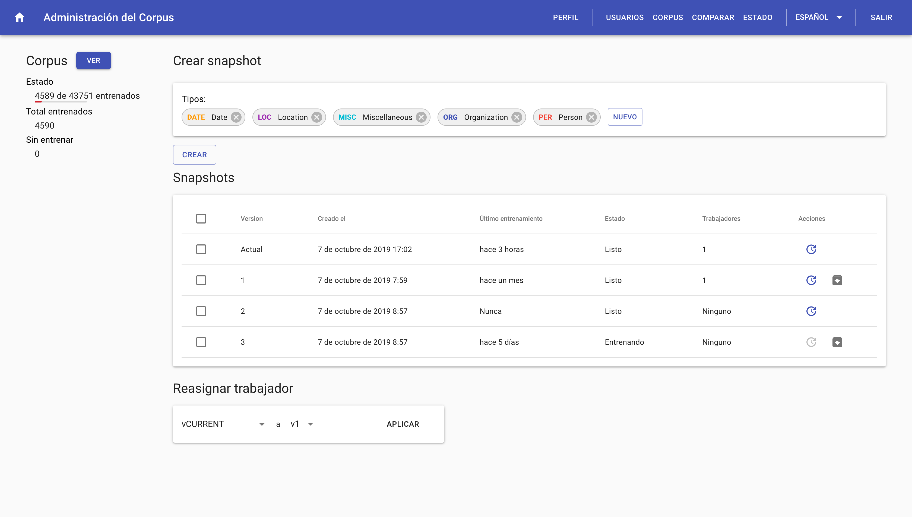

# NERd (Implementación) {#implementation}

Definido el problema, queda claro que la creación de un modelo entrenado es de vital importancia para cualquier problema de tagueo de entidades.
Es por ello que en el presente proyecto final hemos creado una herramienta para el entrenamiento eficiente de modelos estadísticos así como también una interfaz y API para poder consultar entidades.
El nombre de esta herramienta es **NERd**, sigla cuyo significado en inglés es _**N**amed **E**ntity **R**ecognition **D**uh_^[Expresión de obviedad. _Used to express your belief that what was said was extremely obvious_ [@cambridge_duh]]!

Para organizar este capítulo vamos a realizar una descripción basada en el modelo de vistas de arquitectura 4+1.

```{r arq41, echo = FALSE, fig.pos="H", fig.align = 'center', fig.cap='Ilustración de arquitectura 4+1'}
knitr::include_graphics('assets/4+1_Architectural_View_Model.svg')
```

Este modelo nos permite describir la aplicación de una manera genérica y ordenada.

> _The “4+1” view model is rather “generic”: other notations and tools can be used, other design methods can be used, especially for the logical and process decompositions, but we have indicated the ones we have used with success._
>
> `r tufte::quote_footer('--- [@Kruchten:1995:VMA:624610.625529]')` 

## Vista lógica

<!-- Los diagramas UML se utilizan para representar la vista lógica e incluyen diagramas de clase y diagramas de estado. -->

### Inicio

Pantalla de inicio donde se encuentran accesos rápidos para entrenar el modelo o para poder buscar entidades en textos.
También se encuentra aquí una lista de los 5 usuarios que más contribuyeron a entrenar el modelo. Detrás de esta funcionalidad se busca generar un espíritu competitivo entre los usuarios para que los mismos busquen contribuir más.

```{r logic-home, echo = FALSE, fig.pos="H", fig.align = 'center', fig.cap='Pantalla de inicio con usuario logueado'}
knitr::include_graphics('assets/logic/home-logged-all.png')
```
Si la persona no cuenta con permisos de entrenador, se le sugiere que contacte a un administrador para que le otorgue el permiso.

```{r logic-home-logged-nontrainer, echo = FALSE, fig.pos="H", fig.align = 'center', fig.cap='Pantalla de inicio sin rol de entrenador'}
knitr::include_graphics('assets/logic/home-logged-not_trainer.png')
```

Si la persona visitando la página no cuenta con una sesión activa, se le invita a ingresar con una cuenta pre-existente o a registrarse.

```{r logic-home-anonymous, echo = FALSE, fig.pos="H", fig.align = 'center', fig.cap='Pantalla de inicio sin sesión'}
knitr::include_graphics('assets/logic/home-anonymous.png')
```

### Entrenamiento

La pantalla de _Entrenamiento_ es el núcleo de la web en la cual es posible entrenar el modelo.

El usuario es presentado con un texto perteneciente al Corpus del servicio con las entidades inferidas por el modelo actual. Con un editor especial, le permitimos al usuario poder corregir las entidades inferidas y enviarle la corrección al servicio. Esa corrección será utilizada posteriormente a la hora de mejorar el modelo actual.

```{r logic-train, echo = FALSE, fig.pos="H", fig.align = 'center', fig.cap='Pantalla de entrenamiento'}
knitr::include_graphics('assets/logic/train.png')
```

#### Usabilidad

Tuvimos un foco fuerte en la usabilidad del widget ya que los entrenadores del servicio van a pasar prácticamente todo su tiempo en ésta pantalla, por lo que se tuvieron las siguientes consideraciones en la implementación.

##### Llamado a acción y ayuda

Dado que lo primero que ve el usuario es un texto con anotaciones, agregamos un título que invita al usuario a realizar acciones sobre el texto. De esta manera, le mostramos las dos acciones principales realizables desde el widget de entrenamiento: Click en alguna palabra o entidad y arrastrar un conjunto de palabras para crear una entidad nueva.
Como refuerzo de este llamado a acción, agregamos un botón que al ser clickeado muestra un mensaje de ayuda con instrucciones más detalladas sobre el objetivo del entrenador y las acciones que deben de realizarse sobre el mismo.

```{r logic-train-help, echo = FALSE, fig.pos="H", fig.align = 'center', fig.cap='Ayuda del entrenador'}
knitr::include_graphics('assets/logic/train-help.png')
```

##### Creación y edición de entidades

Para la creación de entidades decidimos ofrecer dos maneras: La primera es arrastrando un conjunto de palabras de manera tal de unirlas todas en una única entidad.
La otra es hacer click en una palabra y ahí se ofrecen opciones dependiendo de la ubicación de la palabra dentro del texto:

- Si no existen entidades en el texto actual, se le asigna por defecto el tipo _MISC_ y se muestran el resto de los tipos para permitir cambiarlo de ser necesario.
- Si existen entidades antes o después, se ofrece la opción de unir la palabra actual con la entidada más próxima para el lado elegido.

```{r logic-train-popup, echo = FALSE, fig.pos="H", fig.align = 'center', fig.cap='Edición de entidad'}
knitr::include_graphics('assets/logic/train-popup.png')
```

Para la edición de entidades decidimos permitir únicamente la modificación del tipo de una entidad inferida.
Si el modelo infirió una entidad de manera incorrecta, ya sea por que sea una entidad inválida o agregó palabras de más a una entidad inválida, permitimos que el usuario remueva la entidad y que después vuelva a agregar la entidad correcta.

##### Optimización en tiempos de carga

Dado que es esperado que un usuario entrene más de un texto, al momento de pedir un texto para mostrar, se pide el siguiente. Mediante este mecanismo de pre-carga, podemos eliminar el tiempo de espera entre texto y texto ofreciendo al usuario una experiencia completamente fluida.

### Administración de usuarios

La pantalla de _Administración de usuarios_ permite a los usuarios con el rol de administrador poder modificar los roles de todos los usuarios del sistema, borrarlos o acceder a los detalles del usuario, tal como la lista de textos entrenados.

```{r logic-user-list, echo = FALSE, fig.pos="H", fig.align = 'center', fig.cap='Administración de usuarios'}
knitr::include_graphics('assets/logic-user-list.png')
```

### Detalles de usuario

La pantalla de detalle de usuario permite al usuario con sesión activa ver sus entrenamientos y cambiar su contraseña.

Los usuarios con rol administrador pueden realizar las acciones mencionadas previamente pero a otros usuarios.

```{r logic-user-profile, echo = FALSE, fig.pos="H", fig.align = 'center', fig.cap='Perfil de usuario'}
knitr::include_graphics('assets/logic/user-profile.png')
```

### Corpus

La pantalla de _Corpus_ permite a un usuario con el rol de administrador realizar tareas relacionadas con el corpus del sistema.

```{r logic-corpus-management, echo = FALSE, fig.pos="H", fig.align = 'center', fig.cap='Administración de corpus'}
knitr::include_graphics('assets/logic/corpus-management.png')
```

Desde aquí es posible agregar textos al corpus utilizando la funcionalidad de subida de archivos. Los archivos deben ser archivos con extensión _.txt_ y cada línea del archivo será agregada al corpus como un texto individual.

También es posible desde aquí ver todos los textos que forman parte del corpus así como también poder ver los entrenamientos para cada uno de los textos. Finalmente, es posible quitar textos del corpus así como también es posible eliminar correcciones a las inferencias de entidades cargados por usuarios.

### Estado

La pantalla de _Estado_ permite a un usuario con el rol de administrador visualizar el estado de entrenamiento del corpus así como también realizar diversas acciones sobre los _workers_.

```{r logic-status, echo = FALSE, fig.pos="H", fig.align = 'center', fig.cap='Información de corpus y manejo de workers'}

```

#### Secciones

##### Corpus

Es la columna la izquierda y aquí se puede ver rápidamente que porcentaje de el corpus contiene correcciones por usuarios así como también saber la cantidad total de correcciones del sistema (un texto puede tener más de una corrección por distintos usuarios) y también presenta un botón que permite al administrador ir a la pantalla de _Corpus_.

##### Crear snapshot

Es la sección en la cual será posible crear, borrar o modificar los tipos de entidades reconocidos por el snapshot actual. La acción de editar las entidades genera un snapshot nuevo.

Si el administrador así lo quisiera, puede utilizar esta sección para crear un snapshot nuevo sin editar entidades.

##### Snapshots

Sección en la cual podemos ver la lista completa de snapshots.
Para cada Snapshot, se muestra cuando fue la última vez que se entrenó así como también cuantos trabajadores tiene asignados. Finalmente es posible desde aquí forzar a entrenar el modelo para ese snapshot en particular y también se presenta la opción para desentrenar, borrando el modelo guardado en el disco.

##### Reasignar trabajador

Sección que permite reasignar trabajadores para que sirvan un snapshot distinto. De esta manera se pueden servir distintas versiones del modelo de inferencia para poder realizar distintas pruebas sobre los mismos.


### Sandbox

La pantalla de _Sandbox_ permite a los usuarios hacer consultas al servicio NERd para poder obtener entidades nombradas a partir de textos arbitrarios.
Adicionalmente, si el usuario tiene el rol de entrenador, podrá corregir las entidades inferidas y agregar el texto con sus correcciones al corpus.

```{r logic-sandbox, echo = FALSE, fig.pos="H", fig.align = 'center', fig.cap='Inferencia de entidades en sandbox'}
knitr::include_graphics('assets/logic/sandbox.png')
```

### Comparar

Sección accesible únicamente a administradores en la que es posible comparar las entidades inferidas por dos modelos distintos. A su vez, si el usuario logueado tiene el permiso de entrenador, es posible corregir de manera inline los errores en la inferencia del modelo actual.

```{r logic-compare, echo = FALSE, fig.pos="H", fig.align = 'center', fig.cap='Comparativa de modelos'}
knitr::include_graphics('assets/logic/compare.png')
```

## Vista de proceso
> La vista de proceso trata los aspectos dinámicos del sistema, explica los procesos del sistema y cómo se comunican, y se centra en el comportamiento del sistema en tiempo de ejecución.
La vista de proceso aborda concurrencia, distribución, integradores, rendimiento y escalabilidad, etc.
<!-- Los diagramas UML para representar la vista de proceso incluyen el diagrama de actividad. -->

<!-- TODO: explicar ui vs backend vs mensajes amq vs workers (no detalles de implementación ver siguiente) -->

## Vista de desarrollo
> La vista de desarrollo ilustra un sistema desde la perspectiva de un programador y se ocupa de la gestión de software.
Esta vista también se conoce como la vista de implementación.
<!-- Utiliza el diagrama de componentes UML para describir los componentes del sistema. -->
<!-- Los diagramas UML utilizados para representar la vista de desarrollo incluyen el diagrama del paquete. -->

<!-- TODO: explicar implementación de software ui y backend. Python, React, etc.-->

Python es el lenguaje más utilizado para resolver problemas de Machine Learning, en especial NLP [@github_machine_learning]

Spacy es el framework mejor ranqueado para la tarea de NLP [@github_machine_learning].
Su implementación es robusta y orientada a la implementción de apliciones en producción, a diferencia de muchas otras librerías de NLP que sólo se utilizan con fines académicos.


## Vista física
> La vista física representa el sistema desde el punto de vista de un ingeniero de sistemas.
Se refiere a la topología de los componentes de software en la capa física, así como a las conexiones físicas entre estos componentes.
Esta vista también se conoce como la vista de _deployment_.
<!-- Los diagramas UML utilizados para representar la vista física incluyen el diagrama de deployment. -->

<!-- TODO: explicar docker. docker-package. red. nginx. etc -->

## Escenarios
> La descripción de una arquitectura se ilustra utilizando un pequeño conjunto de casos de uso, o escenarios, que se convierten en una quinta vista.
> Los escenarios describen secuencias de interacciones entre objetos y entre procesos.
> Se utilizan para identificar elementos arquitectónicos y para ilustrar y validar el diseño de la arquitectura.
> También sirven como punto de partida para las pruebas de un prototipo de arquitectura.
> Esta vista también se conoce como vista de caso de uso. 

<!-- TODO: explicar algún caso de uso completo. Maybe el PF de pablo? -->


